# Communication Flow

## Overview

The P2P chat application uses a hybrid communication model combining MQTT for signaling and WebRTC for data transfer. This document details the complete communication flow.

## Communication Layers

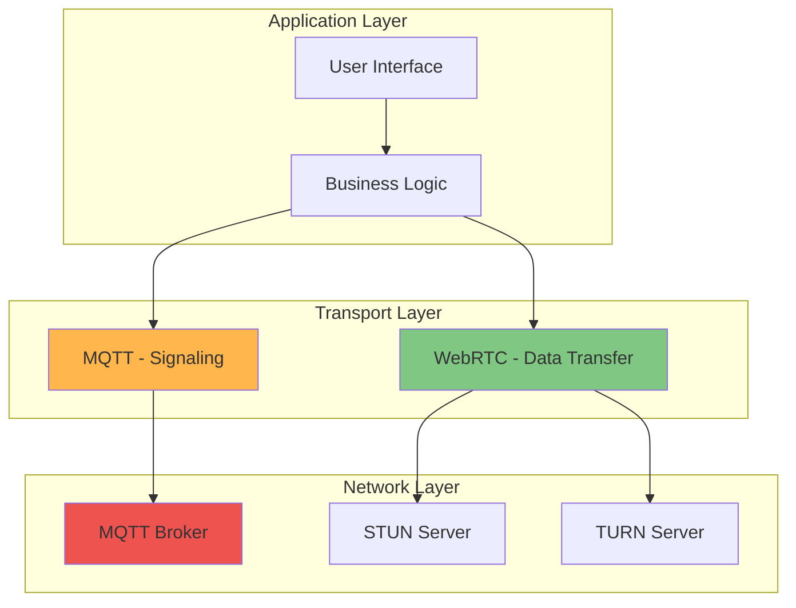
```mermaid
graph TB
    subgraph "Application Layer"
        UI[User Interface]
        Logic[Business Logic]
    end
    
    subgraph "Transport Layer"
        MQTT[MQTT - Signaling]
        WebRTC[WebRTC - Data Transfer]
    end
    
    subgraph "Network Layer"
        Broker[MQTT Broker]
        STUN[STUN Server]
        TURN[TURN Server]
    end
    
    UI --> Logic
    Logic --> MQTT
    Logic --> WebRTC
    MQTT --> Broker
    WebRTC --> STUN
    WebRTC --> TURN
    
    style MQTT fill:#ffb74d
    style WebRTC fill:#81c784
    style Broker fill:#ef5350
```

## 1. Signaling Phase (MQTT)

### MQTT Topic Structure

```
user/{userId}/                    # User's main topic
├── offer                         # WebRTC offers
├── answer                        # WebRTC answers
├── iceCandidate                  # ICE candidates
├── contactRequest                # Contact requests
├── contactResponse               # Contact responses
├── chatPresence                  # Presence updates
└── heartbeat                     # Connection heartbeats
```

### Message Types

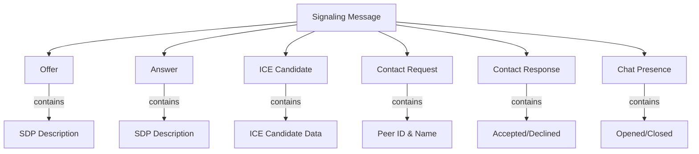
```mermaid
graph TB
    SignalingMsg[Signaling Message]
    
    SignalingMsg --> Offer[Offer]
    SignalingMsg --> Answer[Answer]
    SignalingMsg --> ICE[ICE Candidate]
    SignalingMsg --> Contact[Contact Request]
    SignalingMsg --> Response[Contact Response]
    SignalingMsg --> Presence[Chat Presence]
    
    Offer --> |contains| SDP1[SDP Description]
    Answer --> |contains| SDP2[SDP Description]
    ICE --> |contains| Candidate[ICE Candidate Data]
    Contact --> |contains| PeerInfo[Peer ID & Name]
    Response --> |contains| Accepted[Accepted/Declined]
    Presence --> |contains| Status[Opened/Closed]
```

### MQTT Message Flow

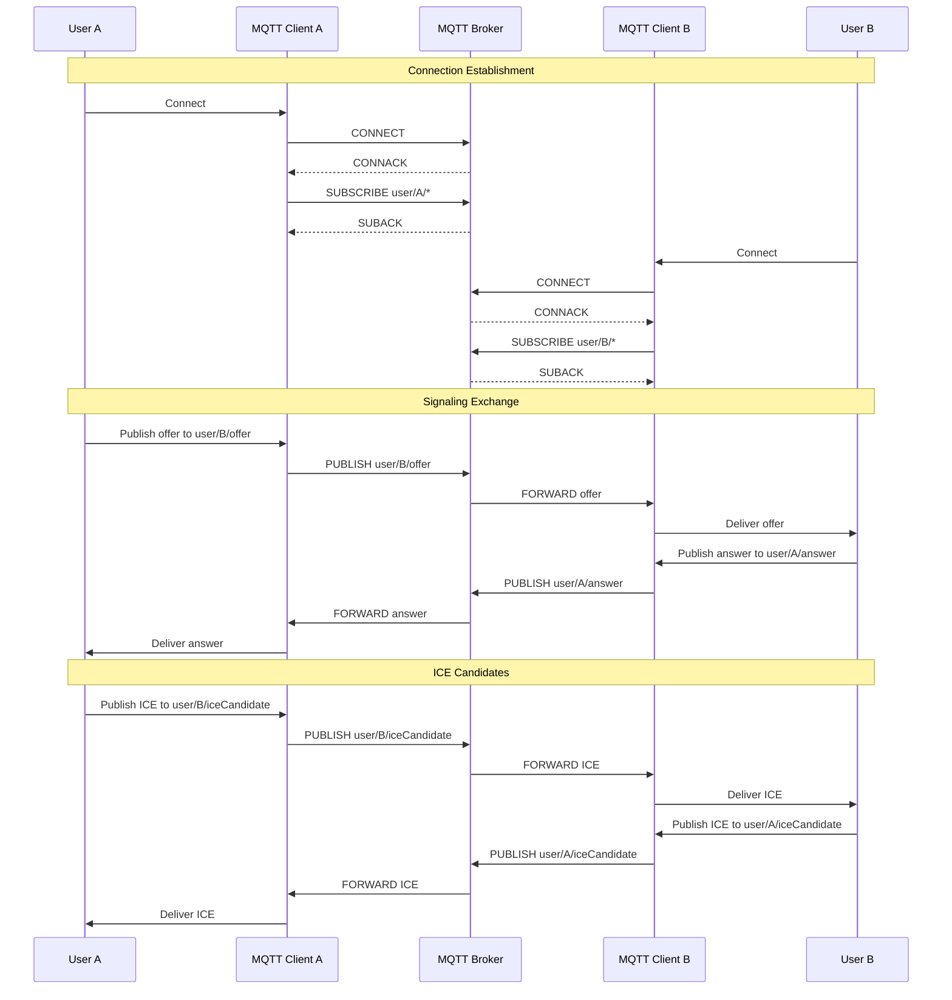
```mermaid
sequenceDiagram
    participant A as User A
    participant MQTT_A as MQTT Client A
    participant Broker as MQTT Broker
    participant MQTT_B as MQTT Client B
    participant B as User B
    
    Note over A,B: Connection Establishment
    
    A->>MQTT_A: Connect
    MQTT_A->>Broker: CONNECT
    Broker-->>MQTT_A: CONNACK
    MQTT_A->>Broker: SUBSCRIBE user/A/*
    Broker-->>MQTT_A: SUBACK
    
    B->>MQTT_B: Connect
    MQTT_B->>Broker: CONNECT
    Broker-->>MQTT_B: CONNACK
    MQTT_B->>Broker: SUBSCRIBE user/B/*
    Broker-->>MQTT_B: SUBACK
    
    Note over A,B: Signaling Exchange
    
    A->>MQTT_A: Publish offer to user/B/offer
    MQTT_A->>Broker: PUBLISH user/B/offer
    Broker->>MQTT_B: FORWARD offer
    MQTT_B->>B: Deliver offer
    
    B->>MQTT_B: Publish answer to user/A/answer
    MQTT_B->>Broker: PUBLISH user/A/answer
    Broker->>MQTT_A: FORWARD answer
    MQTT_A->>A: Deliver answer
    
    Note over A,B: ICE Candidates
    
    A->>MQTT_A: Publish ICE to user/B/iceCandidate
    MQTT_A->>Broker: PUBLISH user/B/iceCandidate
    Broker->>MQTT_B: FORWARD ICE
    MQTT_B->>B: Deliver ICE
    
    B->>MQTT_B: Publish ICE to user/A/iceCandidate
    MQTT_B->>Broker: PUBLISH user/A/iceCandidate
    Broker->>MQTT_A: FORWARD ICE
    MQTT_A->>A: Deliver ICE
```

## 2. WebRTC Connection Establishment

### ICE (Interactive Connectivity Establishment)

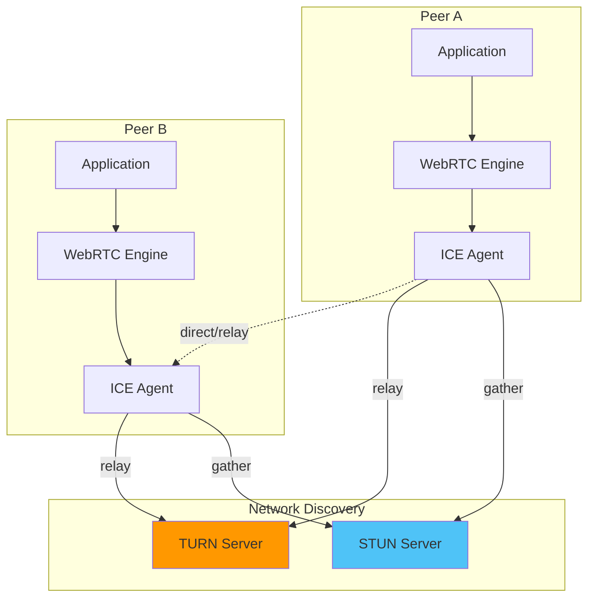
```mermaid
graph TB
    subgraph "Peer A"
        A_App[Application]
        A_WebRTC[WebRTC Engine]
        A_ICE[ICE Agent]
    end
    
    subgraph "Network Discovery"
        STUN[STUN Server]
        TURN[TURN Server]
    end
    
    subgraph "Peer B"
        B_ICE[ICE Agent]
        B_WebRTC[WebRTC Engine]
        B_App[Application]
    end
    
    A_App --> A_WebRTC
    A_WebRTC --> A_ICE
    A_ICE --> |gather| STUN
    A_ICE --> |relay| TURN
    
    B_App --> B_WebRTC
    B_WebRTC --> B_ICE
    B_ICE --> |gather| STUN
    B_ICE --> |relay| TURN
    
    A_ICE -.->|direct/relay| B_ICE
    
    style STUN fill:#4fc3f7
    style TURN fill:#ff9800
```

### Connection Types

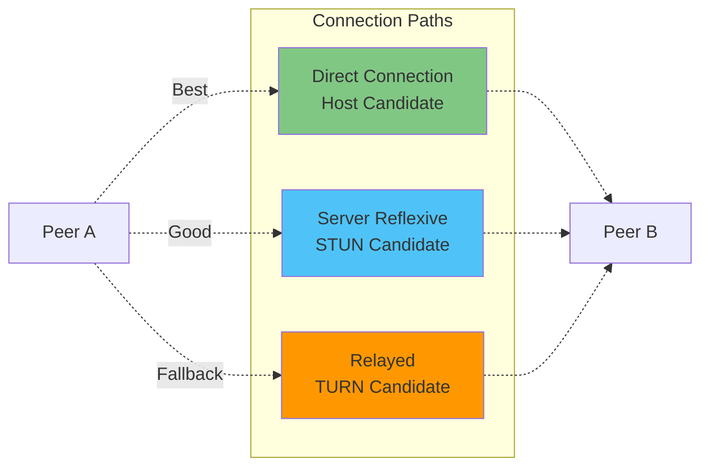
```mermaid
graph LR
    subgraph "Connection Paths"
        Direct[Direct Connection<br/>Host Candidate]
        STUN_Path[Server Reflexive<br/>STUN Candidate]
        TURN_Path[Relayed<br/>TURN Candidate]
    end
    
    PeerA[Peer A] -.->|Best| Direct
    Direct -.-> PeerB[Peer B]
    
    PeerA -.->|Good| STUN_Path
    STUN_Path -.-> PeerB
    
    PeerA -.->|Fallback| TURN_Path
    TURN_Path -.-> PeerB
    
    style Direct fill:#81c784
    style STUN_Path fill:#4fc3f7
    style TURN_Path fill:#ff9800
```

### SDP Exchange

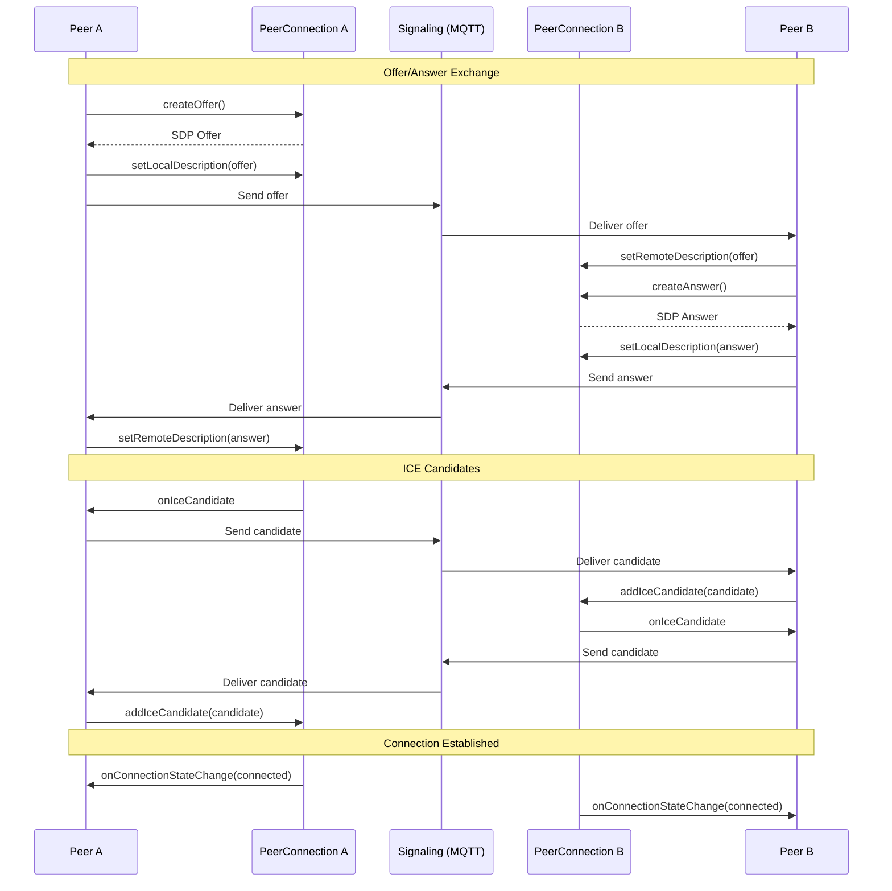
```mermaid
sequenceDiagram
    participant A as Peer A
    participant A_PC as PeerConnection A
    participant Signal as Signaling (MQTT)
    participant B_PC as PeerConnection B
    participant B as Peer B
    
    Note over A,B: Offer/Answer Exchange
    
    A->>A_PC: createOffer()
    A_PC-->>A: SDP Offer
    A->>A_PC: setLocalDescription(offer)
    A->>Signal: Send offer
    Signal->>B: Deliver offer
    B->>B_PC: setRemoteDescription(offer)
    
    B->>B_PC: createAnswer()
    B_PC-->>B: SDP Answer
    B->>B_PC: setLocalDescription(answer)
    B->>Signal: Send answer
    Signal->>A: Deliver answer
    A->>A_PC: setRemoteDescription(answer)
    
    Note over A,B: ICE Candidates
    
    A_PC->>A: onIceCandidate
    A->>Signal: Send candidate
    Signal->>B: Deliver candidate
    B->>B_PC: addIceCandidate(candidate)
    
    B_PC->>B: onIceCandidate
    B->>Signal: Send candidate
    Signal->>A: Deliver candidate
    A->>A_PC: addIceCandidate(candidate)
    
    Note over A,B: Connection Established
    
    A_PC->>A: onConnectionStateChange(connected)
    B_PC->>B: onConnectionStateChange(connected)
```

## 3. Data Transfer Phase (WebRTC)

### Data Channel

```mermaid
graph TB
    subgraph "Peer A"
        A_App[Application]
        A_DC[Data Channel]
        A_SCTP[SCTP]
        A_DTLS[DTLS]
    end
    
    subgraph "Network"
        Network[Internet]
    end
    
    subgraph "Peer B"
        B_DTLS[DTLS]
        B_SCTP[SCTP]
        B_DC[Data Channel]
        B_App[Application]
    end
    
    A_App -->|send message| A_DC
    A_DC --> A_SCTP
    A_SCTP --> A_DTLS
    A_DTLS -->|encrypted| Network
    
    Network -->|encrypted| B_DTLS
    B_DTLS --> B_SCTP
    B_SCTP --> B_DC
    B_DC -->|receive message| B_App
    
    style A_DTLS fill:#ef5350
    style B_DTLS fill:#ef5350
```

### Message Format

```typescript
// Message structure sent over data channel
interface ChatMessage {
  id: string;           // Unique message ID
  from: string;         // Sender ID
  to: string;           // Recipient ID
  content: string;      // Message content
  timestamp: number;    // Unix timestamp
  type: 'text';         // Message type
}
```

### Message Flow

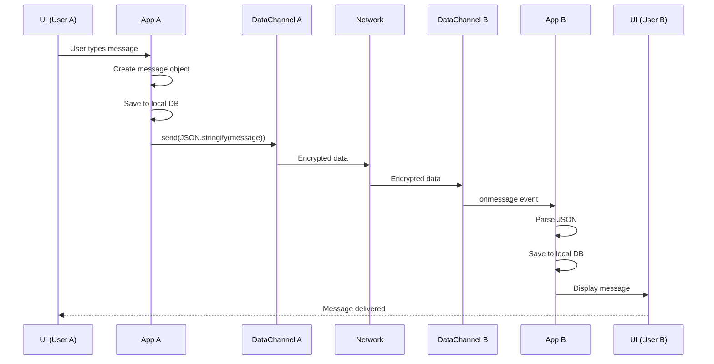
```mermaid
sequenceDiagram
    participant UI_A as UI (User A)
    participant App_A as App A
    participant DC_A as DataChannel A
    participant Network
    participant DC_B as DataChannel B
    participant App_B as App B
    participant UI_B as UI (User B)
    
    UI_A->>App_A: User types message
    App_A->>App_A: Create message object
    App_A->>App_A: Save to local DB
    App_A->>DC_A: send(JSON.stringify(message))
    DC_A->>Network: Encrypted data
    Network->>DC_B: Encrypted data
    DC_B->>App_B: onmessage event
    App_B->>App_B: Parse JSON
    App_B->>App_B: Save to local DB
    App_B->>UI_B: Display message
    UI_B-->>UI_A: Message delivered
```

## 4. Connection States

### WebRTC Connection States

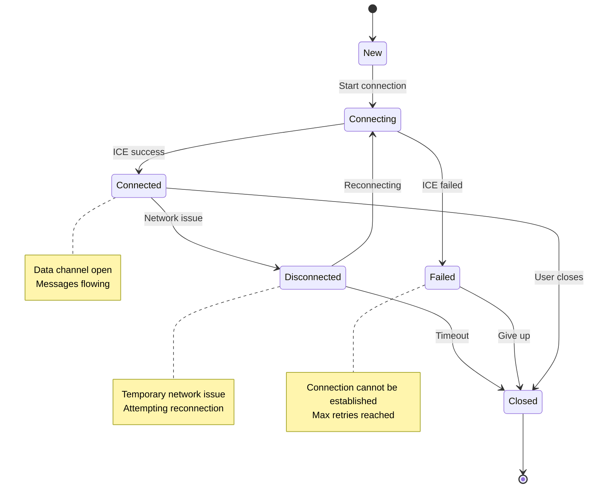
```mermaid
stateDiagram-v2
    [*] --> New
    New --> Connecting: Start connection
    Connecting --> Connected: ICE success
    Connecting --> Failed: ICE failed
    Connected --> Disconnected: Network issue
    Disconnected --> Connecting: Reconnecting
    Disconnected --> Closed: Timeout
    Failed --> Closed: Give up
    Connected --> Closed: User closes
    Closed --> [*]
    
    note right of Connected
        Data channel open
        Messages flowing
    end note
    
    note right of Disconnected
        Temporary network issue
        Attempting reconnection
    end note
    
    note right of Failed
        Connection cannot be established
        Max retries reached
    end note
```

### MQTT Connection States

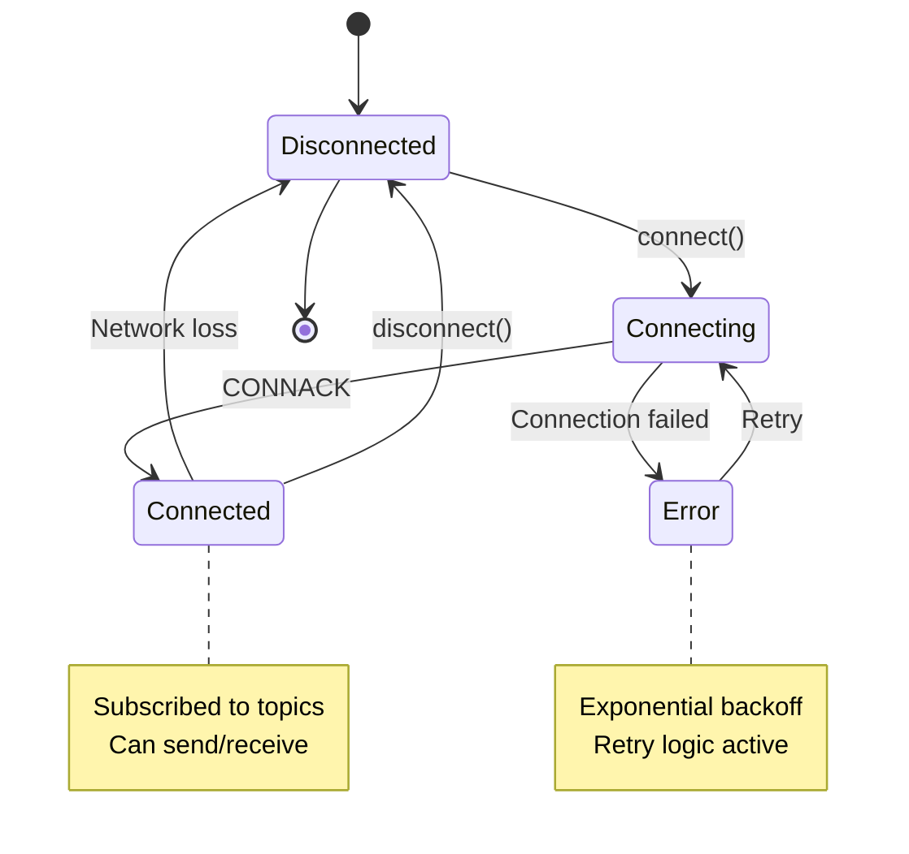
```mermaid
stateDiagram-v2
    [*] --> Disconnected
    Disconnected --> Connecting: connect()
    Connecting --> Connected: CONNACK
    Connecting --> Error: Connection failed
    Connected --> Disconnected: Network loss
    Error --> Connecting: Retry
    Connected --> Disconnected: disconnect()
    Disconnected --> [*]
    
    note right of Connected
        Subscribed to topics
        Can send/receive
    end note
    
    note right of Error
        Exponential backoff
        Retry logic active
    end note
```

## 5. Network Topology

### Peer-to-Peer Mesh

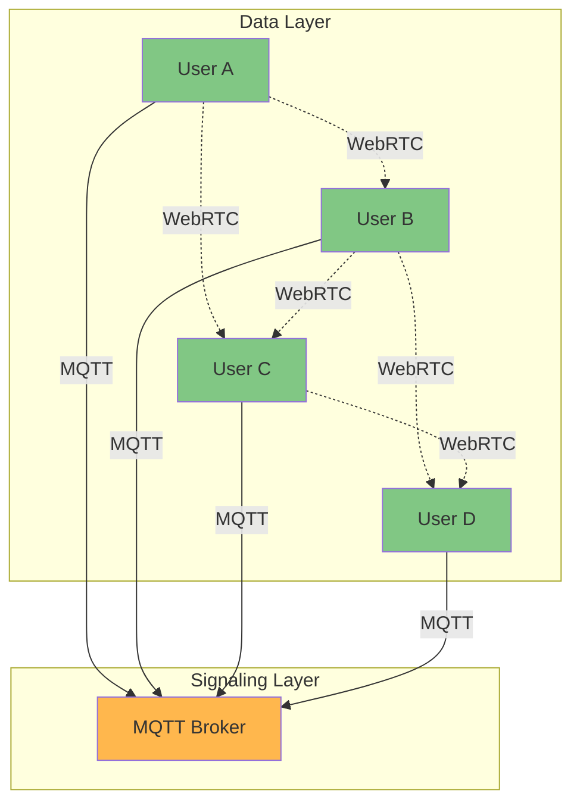
```mermaid
graph TB
    subgraph "Signaling Layer"
        Broker[MQTT Broker]
    end
    
    subgraph "Data Layer"
        A[User A]
        B[User B]
        C[User C]
        D[User D]
    end
    
    A -.->|WebRTC| B
    A -.->|WebRTC| C
    B -.->|WebRTC| C
    B -.->|WebRTC| D
    C -.->|WebRTC| D
    
    A -->|MQTT| Broker
    B -->|MQTT| Broker
    C -->|MQTT| Broker
    D -->|MQTT| Broker
    
    style Broker fill:#ffb74d
    style A fill:#81c784
    style B fill:#81c784
    style C fill:#81c784
    style D fill:#81c784
```

## 6. Security

### Encryption Layers

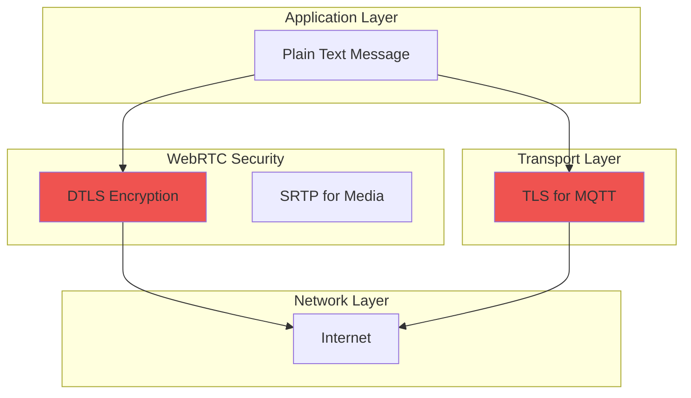
```mermaid
graph TB
    subgraph "Application Layer"
        Message[Plain Text Message]
    end
    
    subgraph "WebRTC Security"
        DTLS[DTLS Encryption]
        SRTP[SRTP for Media]
    end
    
    subgraph "Transport Layer"
        TLS[TLS for MQTT]
    end
    
    subgraph "Network Layer"
        Network[Internet]
    end
    
    Message --> DTLS
    DTLS --> Network
    
    Message --> TLS
    TLS --> Network
    
    style DTLS fill:#ef5350
    style TLS fill:#ef5350
```

### Security Features

1. **DTLS (Datagram Transport Layer Security)**
   - End-to-end encryption for WebRTC data
   - Perfect forward secrecy
   - Certificate-based authentication

2. **TLS for MQTT**
   - Encrypted signaling messages
   - Broker authentication
   - Message integrity

3. **ICE Security**
   - STUN/TURN authentication
   - Credential-based access
   - Short-lived credentials

## 7. Performance Optimization

### Connection Pooling

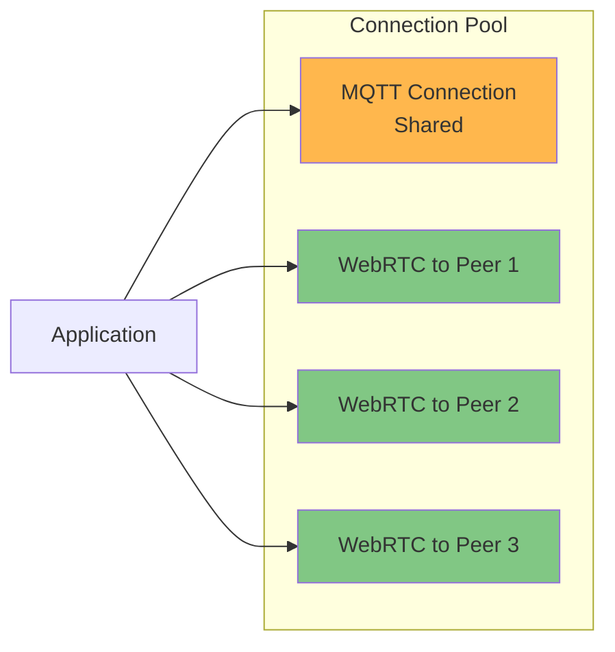
```mermaid
graph LR
    App[Application]
    
    subgraph "Connection Pool"
        MQTT[MQTT Connection<br/>Shared]
        WebRTC1[WebRTC to Peer 1]
        WebRTC2[WebRTC to Peer 2]
        WebRTC3[WebRTC to Peer 3]
    end
    
    App --> MQTT
    App --> WebRTC1
    App --> WebRTC2
    App --> WebRTC3
    
    style MQTT fill:#ffb74d
    style WebRTC1 fill:#81c784
    style WebRTC2 fill:#81c784
    style WebRTC3 fill:#81c784
```

### Message Batching

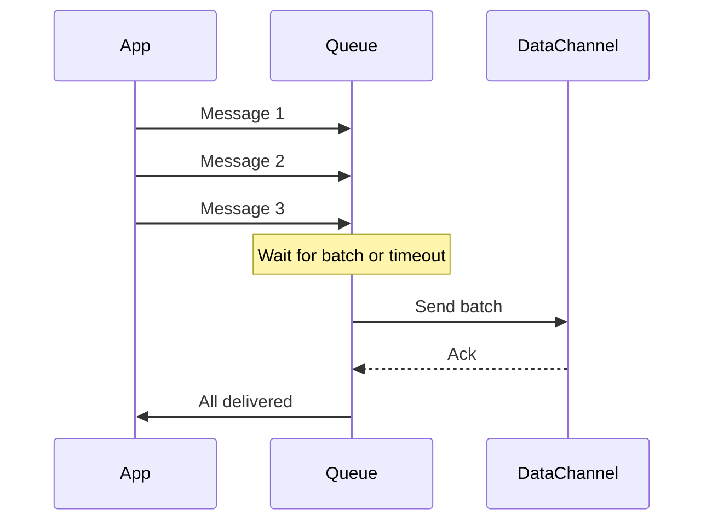
```mermaid
sequenceDiagram
    participant App
    participant Queue
    participant DataChannel
    
    App->>Queue: Message 1
    App->>Queue: Message 2
    App->>Queue: Message 3
    
    Note over Queue: Wait for batch or timeout
    
    Queue->>DataChannel: Send batch
    DataChannel-->>Queue: Ack
    Queue->>App: All delivered
```

## 8. Error Handling

### Retry Strategy

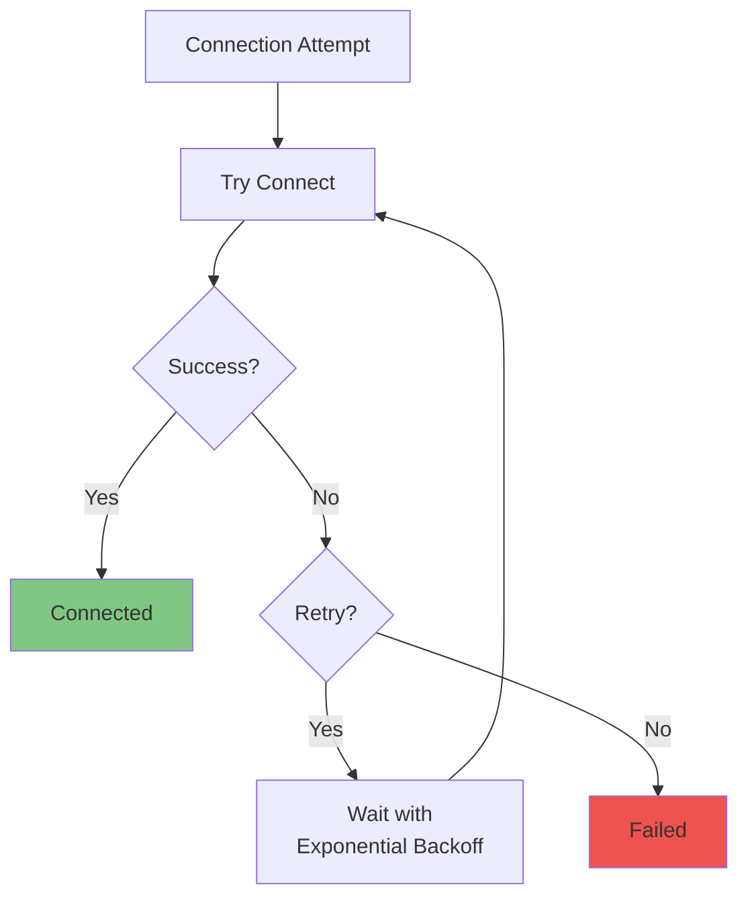
```mermaid
graph TB
    Start[Connection Attempt]
    Start --> Try[Try Connect]
    Try --> Success{Success?}
    Success -->|Yes| Connected[Connected]
    Success -->|No| Retry{Retry?}
    Retry -->|Yes| Wait[Wait with<br/>Exponential Backoff]
    Wait --> Try
    Retry -->|No| Failed[Failed]
    
    style Connected fill:#81c784
    style Failed fill:#ef5350
```

### Backoff Algorithm

```
Attempt 1: 1 second
Attempt 2: 2 seconds
Attempt 3: 4 seconds
Attempt 4: 8 seconds
Attempt 5: 16 seconds
Max: 32 seconds
```

## Summary

The communication flow combines:
1. **MQTT** for reliable signaling and presence
2. **WebRTC** for efficient peer-to-peer data transfer
3. **ICE** for NAT traversal and connection establishment
4. **DTLS/TLS** for end-to-end security
5. **Retry logic** for resilience
6. **State management** for reliability

This hybrid approach provides the best of both worlds: reliable signaling through MQTT and efficient data transfer through WebRTC.
