# Component Architecture

## System Architecture Overview

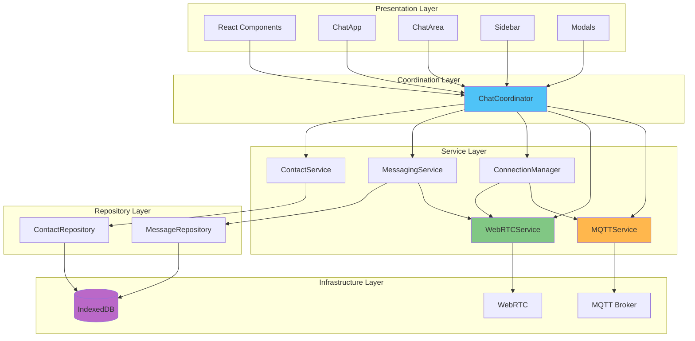

## Component Details

### 1. Presentation Layer

#### ChatApp Component
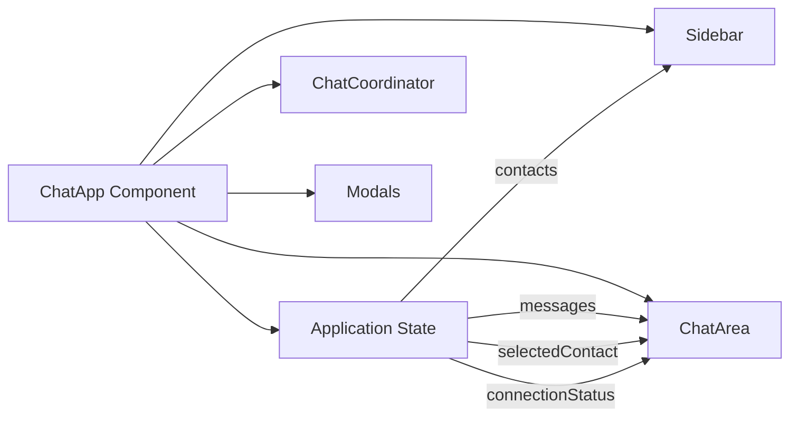

**Responsibilities:**
- Main application container
- Manages global application state
- Coordinates UI components
- Handles user interactions
- Displays modals and dialogs

**State:**
- `contacts`: List of all contacts
- `selectedContact`: Currently selected contact
- `messages`: Messages for selected contact
- `connectionStatus`: Current connection state
- `showContactModal`: Contact dialog visibility

#### ChatArea Component
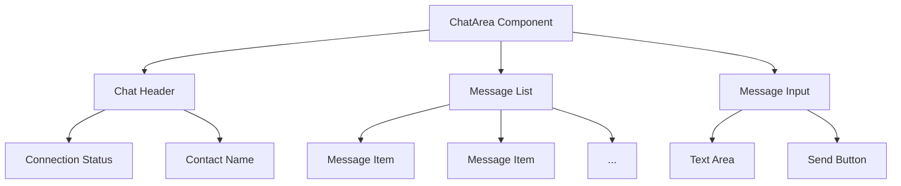

**Responsibilities:**
- Displays chat messages
- Shows connection status
- Handles message input
- Auto-scrolls to latest message
- Shows typing indicators

#### Sidebar Component
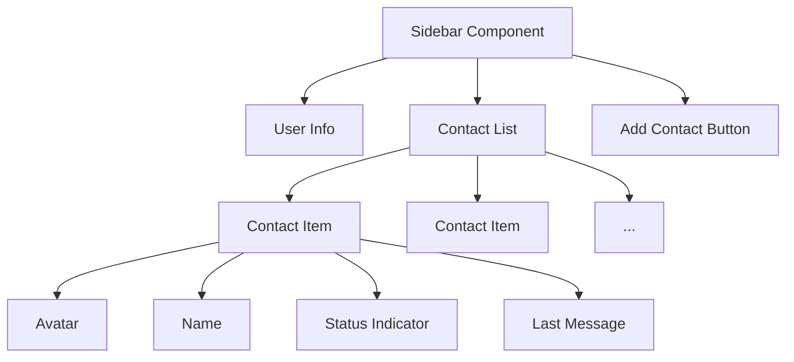

**Responsibilities:**
- Displays contact list
- Shows user information
- Provides add contact functionality
- Indicates connection status per contact
- Shows last message preview

### 2. Coordination Layer

#### ChatCoordinator
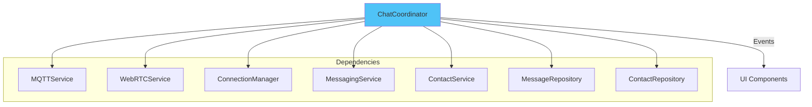

**Responsibilities:**
- Orchestrates all services
- Provides unified API for UI
- Manages service lifecycle
- Handles cross-service coordination
- Implements event aggregation

**Key Methods:**
- `initialize()`: Initialize all services
- `sendMessage(content)`: Send a message
- `selectContact(contact)`: Select a contact to chat with
- `addContact(peerId, name)`: Add new contact
- `acceptContact(peerId, name)`: Accept contact request
- `dispose()`: Clean up resources

### 3. Service Layer

#### MQTTService
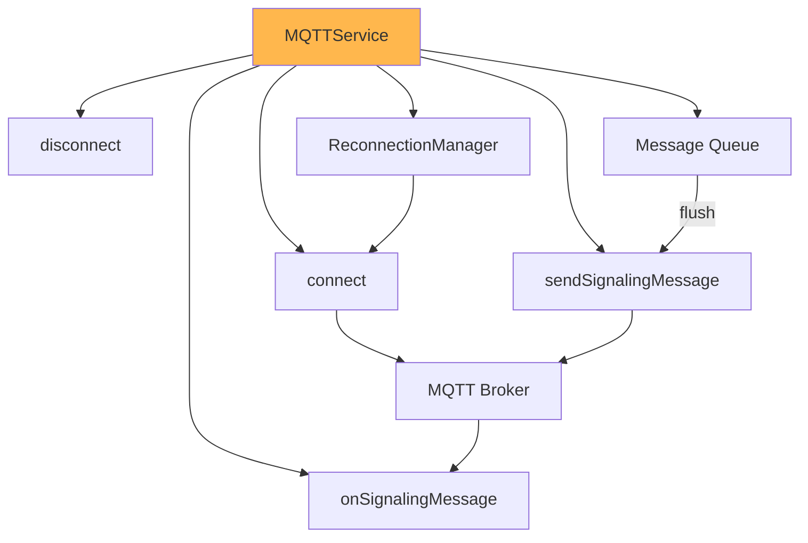

**Responsibilities:**
- MQTT broker connection management
- Signaling message transmission
- Message queuing when offline
- Automatic reconnection
- Heartbeat monitoring

**Configuration:**
- Broker URL: `ws://localhost:9001`
- Topics: `user/{userId}`
- QoS: 1 (at least once delivery)
- Reconnection: Exponential backoff

#### WebRTCService
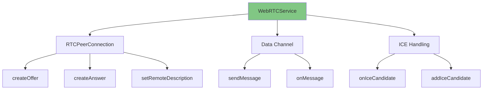

**Responsibilities:**
- WebRTC peer connection management
- SDP offer/answer creation
- ICE candidate handling
- Data channel management
- Message transmission

**Configuration:**
- ICE Servers: STUN/TURN servers
- Data Channel: Reliable, ordered
- Connection timeout: 30 seconds

#### ConnectionManager
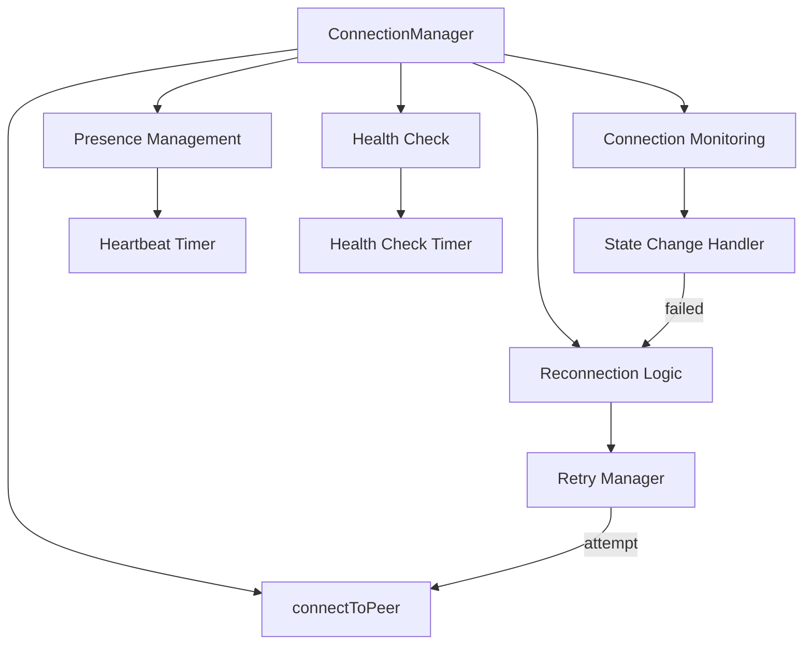

**Responsibilities:**
- Connection lifecycle management
- Connection health monitoring
- Automatic reconnection
- Presence heartbeat
- Connection state tracking

**Timers:**
- Presence heartbeat: 30 seconds
- Health check: 10 seconds
- Connection timeout: 30 seconds

#### MessagingService
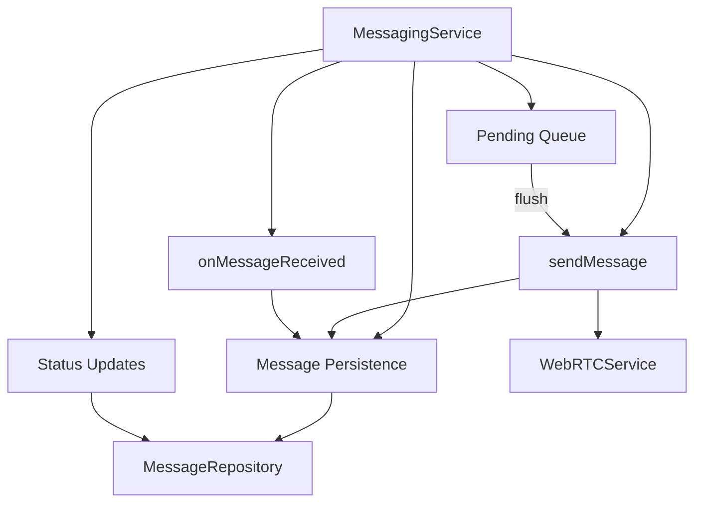

**Responsibilities:**
- Message sending/receiving
- Message persistence
- Pending message queue
- Delivery status tracking
- Message validation

#### ContactService
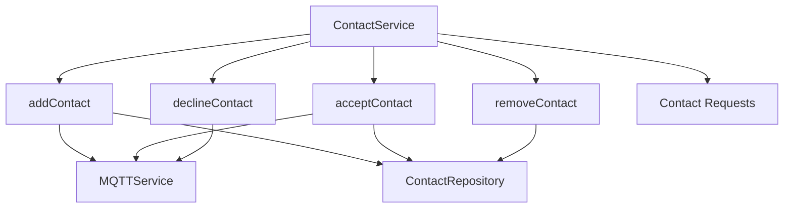

**Responsibilities:**
- Contact management
- Contact request handling
- Contact persistence
- Contact validation

### 4. Repository Layer

#### MessageRepository
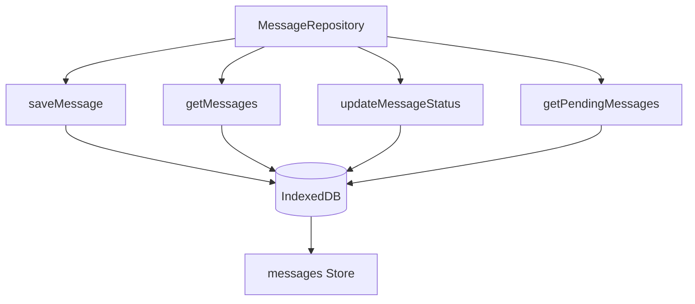

**Schema:**
```typescript
interface Message {
  id: string;
  userId: string;
  contactId: string;
  content: string;
  timestamp: Date;
  isSent: boolean;
  status: 'pending' | 'delivered' | 'failed';
}
```

#### ContactRepository
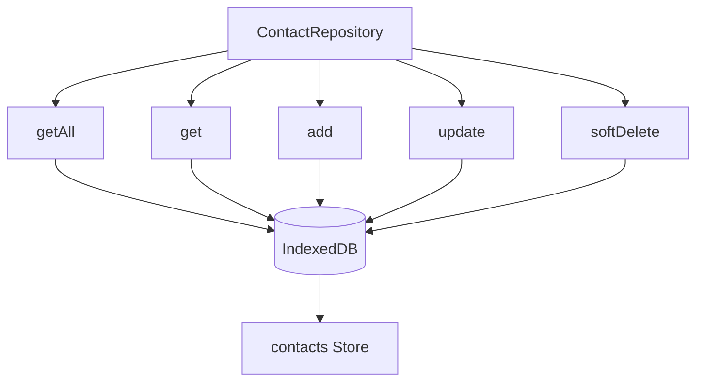

**Schema:**
```typescript
interface Contact {
  id: string;
  name: string;
  status: 'pending' | 'accepted' | 'declined';
  isDeleted: boolean;
  createdAt: Date;
  updatedAt: Date;
}
```

## Data Flow

### Message Send Flow
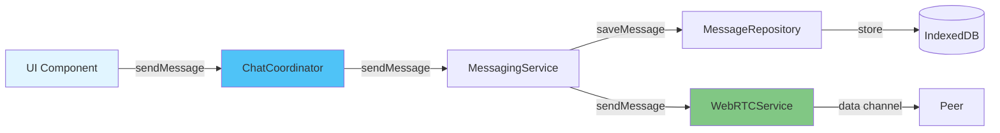

### Connection Establishment Flow
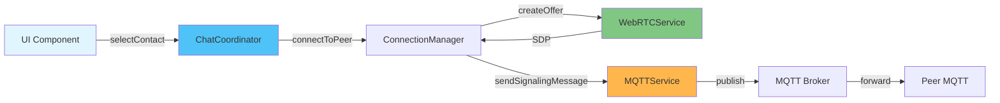

## Interface Definitions

All services implement well-defined interfaces following the Interface Segregation Principle:

- `ISignalingService`: MQTT signaling operations
- `IWebRTCService`: WebRTC peer connection operations
- `IConnectionManager`: Connection lifecycle management
- `IMessageService`: Messaging operations
- `IContactService`: Contact management
- `IMessageRepository`: Message persistence
- `IContactRepository`: Contact persistence
- `IChatCoordinator`: Main coordinator interface

This ensures loose coupling and makes the system highly testable and maintainable.
