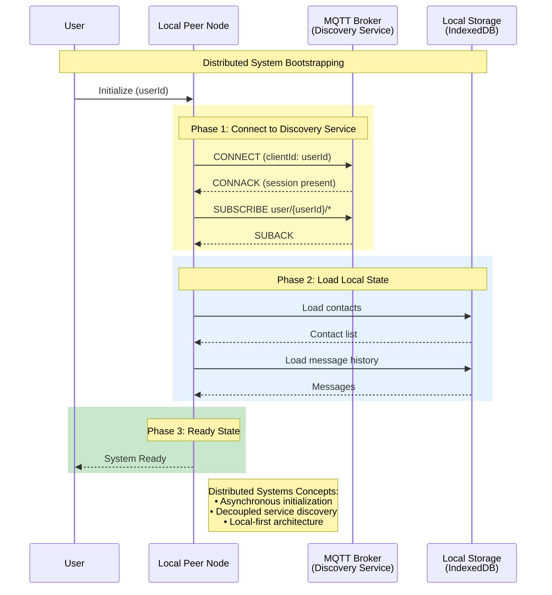
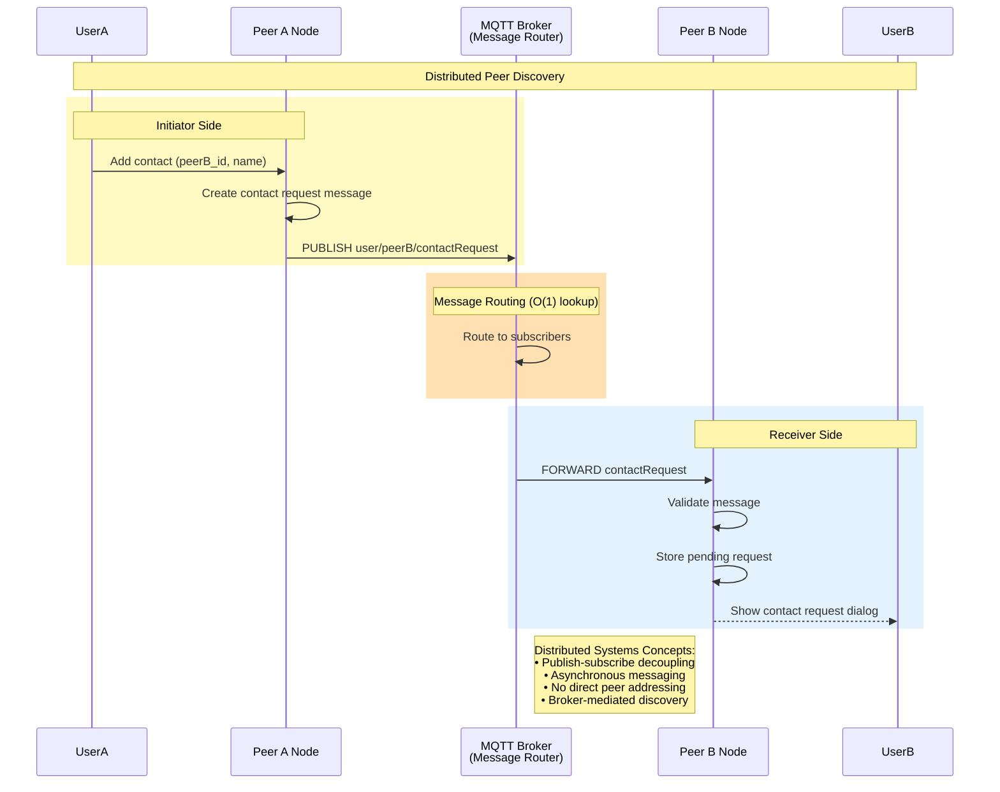
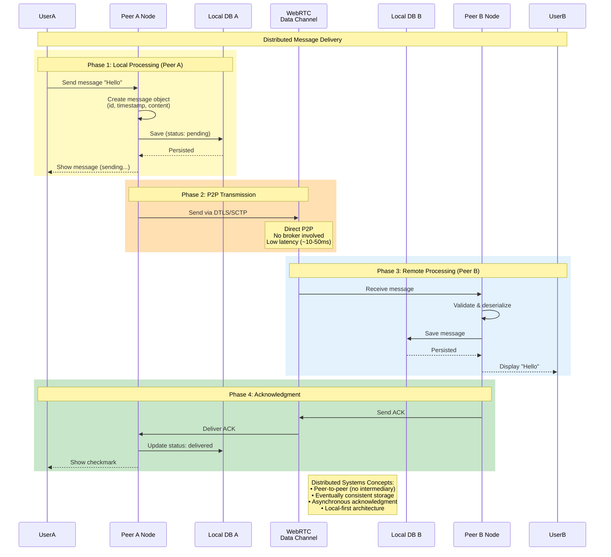
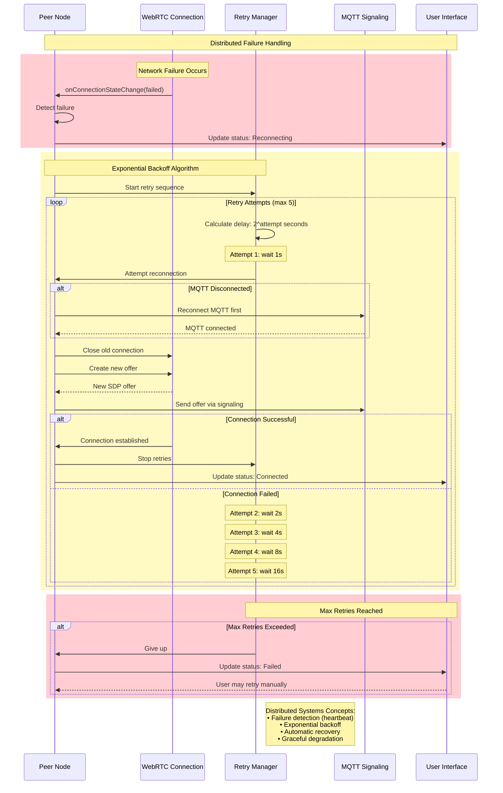
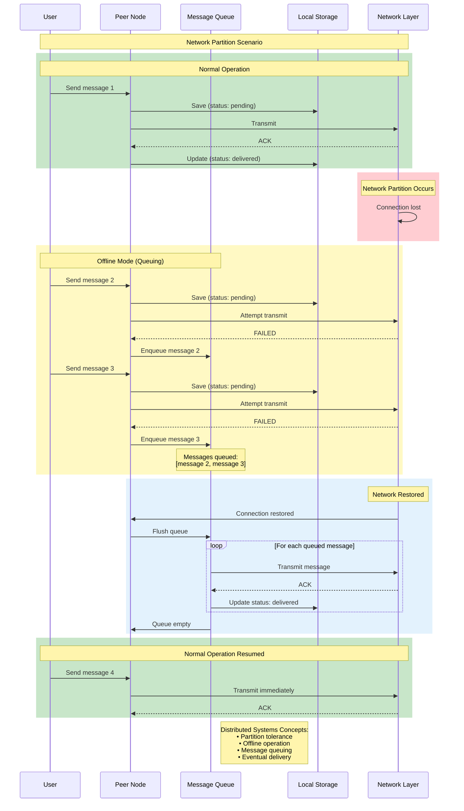
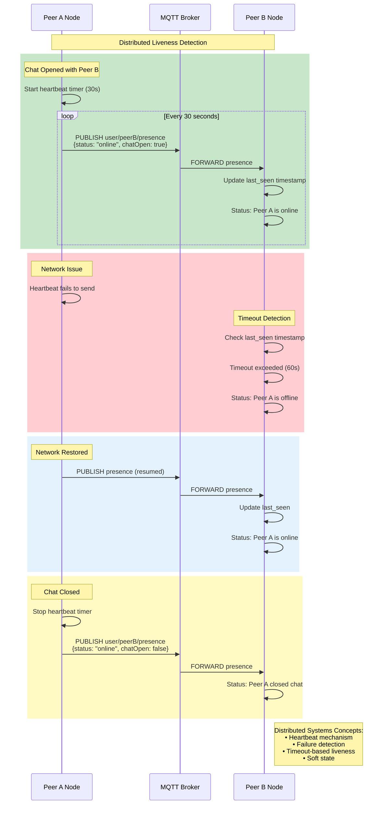

# Sequence Diagrams - Distributed Systems Interactions

## Academic Overview

This document presents sequence diagrams illustrating the temporal interactions between distributed system components in the P2P chat application. These diagrams demonstrate key distributed systems concepts including asynchronous communication, message passing, consensus protocols, and failure recovery.

---

## Diagram 1: System Initialization (Distributed Bootstrapping)

### Concept: Service Discovery and Registration



**Distributed Systems Principles**:
- **Asynchronous Operations**: Non-blocking initialization
- **Service Registration**: MQTT topic subscription for discovery
- **Local State**: Each node maintains independent state
- **No Coordination**: Peers initialize independently

---

## Diagram 2: Peer Discovery and Contact Addition

### Concept: Distributed Peer Discovery via Publish-Subscribe



**Distributed Systems Principles**:
- **Loose Coupling**: Peers don't need direct addresses
- **Publish-Subscribe**: Broker routes messages to subscribers
- **Asynchronous**: Fire-and-forget messaging
- **Scalability**: O(1) routing complexity

---

## Diagram 3: WebRTC Connection Establishment (Distributed Consensus)

### Concept: SDP Offer/Answer Exchange and ICE Negotiation

```mermaid
sequenceDiagram
    participant PeerA as Peer A<br/>(Initiator)
    participant SignalA as Signaling<br/>(MQTT)
    participant Broker as MQTT Broker
    participant SignalB as Signaling<br/>(MQTT)
    participant PeerB as Peer B<br/>(Responder)
    
    Note over PeerA,PeerB: Distributed Connection Negotiation
    
    rect rgb(255, 249, 196)
        Note over PeerA,SignalA: Phase 1: Offer Creation
        PeerA->>PeerA: createOffer() → SDP
        PeerA->>PeerA: setLocalDescription(offer)
        PeerA->>SignalA: Send offer
        SignalA->>Broker: PUBLISH user/peerB/offer
    end
    
    rect rgb(255, 224, 178)
        Note over Broker: Reliable Message Delivery (QoS 1)
        Broker->>SignalB: FORWARD offer (with ACK)
    end
    
    rect rgb(227, 242, 253)
        Note over SignalB,PeerB: Phase 2: Answer Creation
        SignalB->>PeerB: Deliver offer
        PeerB->>PeerB: setRemoteDescription(offer)
        PeerB->>PeerB: createAnswer() → SDP
        PeerB->>PeerB: setLocalDescription(answer)
        PeerB->>SignalB: Send answer
        SignalB->>Broker: PUBLISH user/peerA/answer
    end
    
    rect rgb(200, 230, 201)
        Note over Broker,PeerA: Phase 3: Answer Delivery
        Broker->>SignalA: FORWARD answer
        SignalA->>PeerA: Deliver answer
        PeerA->>PeerA: setRemoteDescription(answer)
    end
    
    rect rgb(255, 249, 196)
        Note over PeerA,PeerB: Phase 4: ICE Candidate Exchange
        
        par ICE Gathering (Parallel)
            PeerA->>PeerA: Gather ICE candidates
            PeerA->>Broker: PUBLISH candidates
            Broker->>PeerB: FORWARD candidates
            PeerB->>PeerB: addIceCandidate()
        and
            PeerB->>PeerB: Gather ICE candidates
            PeerB->>Broker: PUBLISH candidates
            Broker->>PeerA: FORWARD candidates
            PeerA->>PeerA: addIceCandidate()
        end
    end
    
    rect rgb(200, 230, 201)
        Note over PeerA,PeerB: Phase 5: Direct P2P Connection
        PeerA<->>PeerB: WebRTC Connection Established
        Note over PeerA,PeerB: Signaling complete,<br/>data flows peer-to-peer
    end
    
    Note right of PeerB: Distributed Systems Concepts:<br/>• Two-phase commit (offer/answer)<br/>• Reliable signaling (MQTT QoS 1)<br/>• Parallel ICE gathering<br/>• NAT traversal (STUN/TURN)
```

**Distributed Systems Principles**:
- **Two-Phase Protocol**: Offer/answer handshake
- **Reliable Messaging**: QoS 1 guarantees delivery
- **Concurrent Operations**: Parallel ICE gathering
- **Network Transparency**: NAT traversal abstraction

---

## Diagram 4: Message Transmission (P2P Data Transfer)

### Concept: Direct Peer-to-Peer Communication



**Distributed Systems Principles**:
- **Direct Communication**: Bypasses central server
- **Local-First**: Save locally before transmission
- **Eventually Consistent**: Both databases converge
- **Asynchronous ACK**: Non-blocking confirmation

---

## Diagram 5: Failure Detection and Recovery

### Concept: Fault Tolerance with Exponential Backoff



**Distributed Systems Principles**:
- **Failure Detection**: Heartbeat timeout mechanism
- **Exponential Backoff**: Prevents network flooding
- **Automatic Recovery**: Self-healing system
- **Graceful Degradation**: System remains usable

---

## Diagram 6: Concurrent Connection Attempts (Glare Resolution)

### Concept: Distributed Consensus Without Coordinator

```mermaid
sequenceDiagram
    participant PeerA as Peer A<br/>(ID: alice)
    participant PeerB as Peer B<br/>(ID: bob)
    
    Note over PeerA,PeerB: Glare Scenario: Simultaneous Connection Attempts
    
    rect rgb(255, 249, 196)
        Note over PeerA,PeerB: Phase 1: Simultaneous Offers
        
        par Both create offers
            PeerA->>PeerA: createOffer()
            PeerA->>PeerA: setLocalDescription(offer_A)
        and
            PeerB->>PeerB: createOffer()
            PeerB->>PeerB: setLocalDescription(offer_B)
        end
        
        par Exchange offers
            PeerA->>PeerB: Send offer_A
        and
            PeerB->>PeerA: Send offer_B
        end
    end
    
    rect rgb(255, 205, 210)
        Note over PeerA,PeerB: Phase 2: Glare Detection
        
        PeerA->>PeerA: Receive offer_B (unexpected)
        PeerA->>PeerA: GLARE DETECTED!
        
        PeerB->>PeerB: Receive offer_A (unexpected)
        PeerB->>PeerB: GLARE DETECTED!
    end
    
    rect rgb(200, 230, 201)
        Note over PeerA,PeerB: Phase 3: Deterministic Resolution
        
        PeerA->>PeerA: Compare: "alice" < "bob"
        PeerA->>PeerA: Role: POLITE (lower ID)
        PeerA->>PeerA: rollback() local offer
        PeerA->>PeerA: setRemoteDescription(offer_B)
        PeerA->>PeerA: createAnswer()
        PeerA->>PeerB: Send answer_A
        
        PeerB->>PeerB: Compare: "bob" > "alice"
        PeerB->>PeerB: Role: IMPOLITE (higher ID)
        PeerB->>PeerB: Ignore offer_A
        PeerB->>PeerB: Wait for answer
        PeerB->>PeerB: Receive answer_A
        PeerB->>PeerB: setRemoteDescription(answer_A)
    end
    
    rect rgb(227, 242, 253)
        Note over PeerA,PeerB: Phase 4: Connection Established
        PeerA<->>PeerB: WebRTC connection successful
    end
    
    Note right of PeerB: Distributed Systems Concepts:<br/>• Distributed consensus<br/>• No central coordinator<br/>• Deterministic algorithm<br/>• Symmetric protocol
```

**Distributed Systems Principles**:
- **Distributed Consensus**: Peers agree without coordinator
- **Deterministic Resolution**: Same inputs → same outcome
- **Symmetric Algorithm**: Both peers run identical logic
- **Conflict Resolution**: Lexicographic ordering

---

## Diagram 7: Message Queuing During Network Partition

### Concept: Eventual Consistency and Offline Operation



**Distributed Systems Principles**:
- **Partition Tolerance**: System works during network split
- **Offline Operation**: Local-first architecture
- **Message Queuing**: Buffering for reliability
- **Eventual Delivery**: Guaranteed delivery when connected

---

## Diagram 8: Presence and Liveness Detection

### Concept: Distributed Heartbeat Mechanism



**Distributed Systems Principles**:
- **Heartbeat Protocol**: Periodic liveness signals
- **Failure Detection**: Timeout-based detection
- **Soft State**: Presence information expires
- **Eventual Accuracy**: May have temporary false negatives

---

## Summary: Distributed Systems Concepts Illustrated

| Diagram | Primary Concept | Secondary Concepts |
|---------|----------------|-------------------|
| **1. Initialization** | Service Discovery | Asynchronous bootstrapping, local state |
| **2. Peer Discovery** | Publish-Subscribe | Loose coupling, message routing |
| **3. Connection Setup** | Two-Phase Protocol | Reliable messaging, consensus |
| **4. Message Transfer** | P2P Communication | Local-first, eventual consistency |
| **5. Failure Recovery** | Fault Tolerance | Exponential backoff, self-healing |
| **6. Glare Resolution** | Distributed Consensus | Deterministic algorithms |
| **7. Message Queuing** | Partition Tolerance | Offline operation, eventual delivery |
| **8. Presence** | Liveness Detection | Heartbeat, soft state |

---

## Academic Significance

These sequence diagrams demonstrate:

1. **Asynchronous Communication**: All interactions are non-blocking
2. **Message Passing**: No shared memory, only messages
3. **Distributed Coordination**: Consensus without central authority
4. **Fault Tolerance**: Automatic failure detection and recovery
5. **Eventual Consistency**: Temporary inconsistency for availability
6. **Network Transparency**: Complexity hidden from application
7. **Scalability**: O(1) and O(N) operations, no O(N²)

These patterns are fundamental to distributed systems design and appear in many real-world systems (databases, messaging platforms, distributed file systems, etc.).
