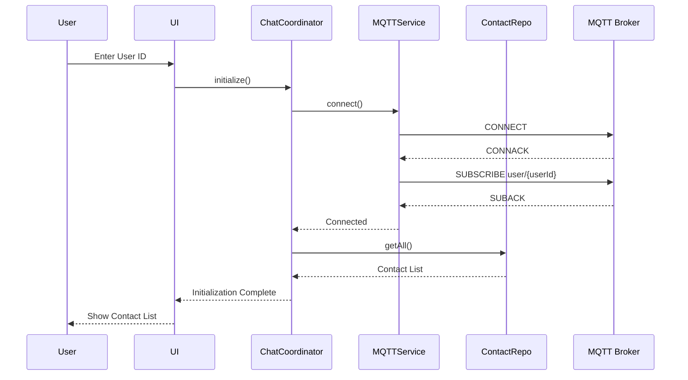
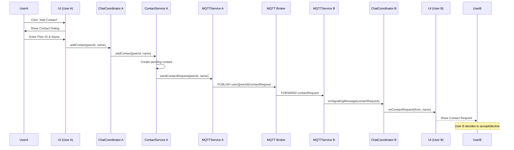
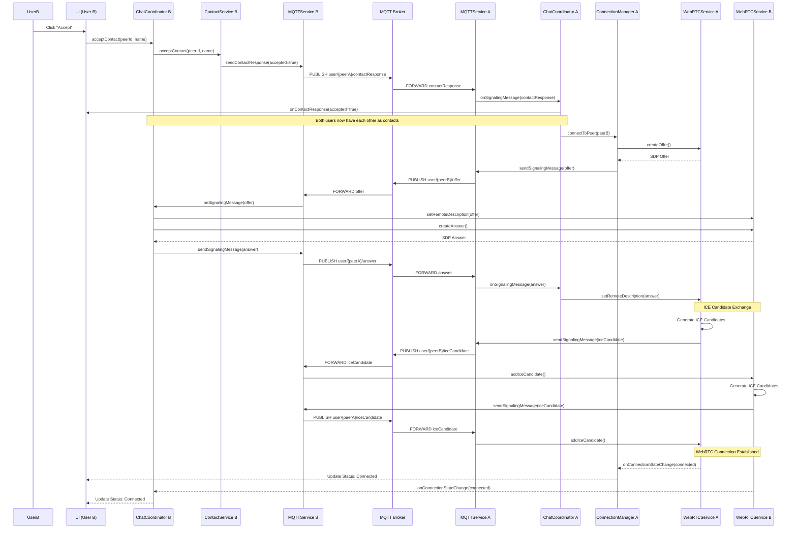
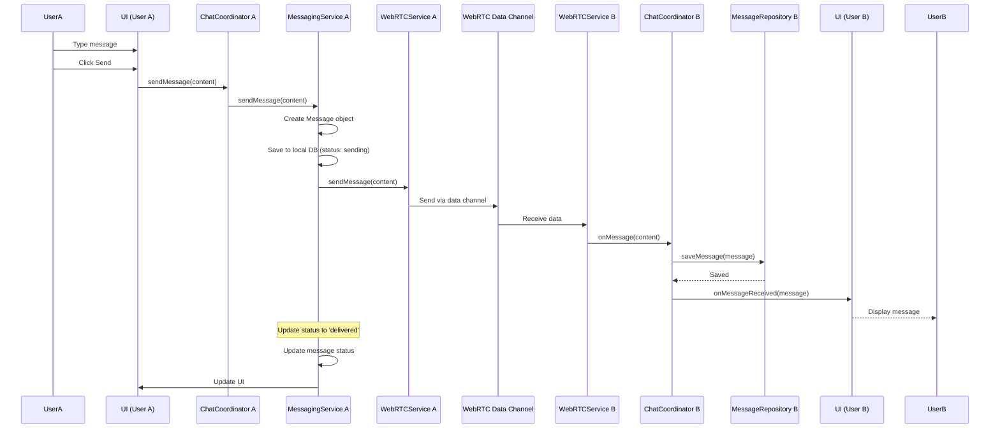
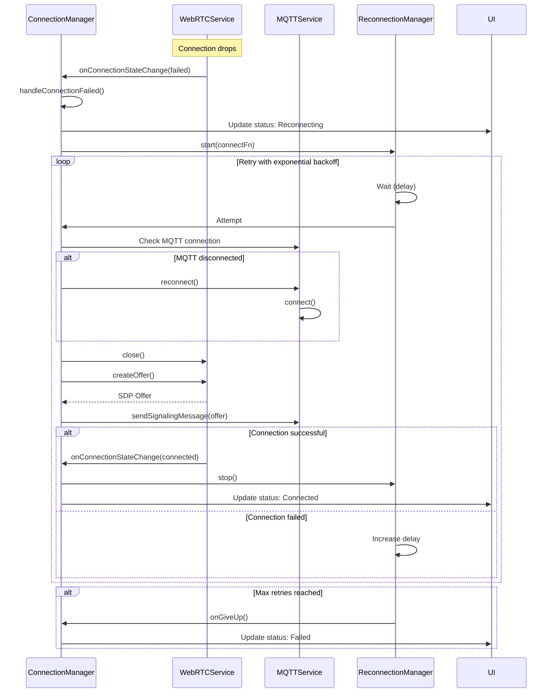
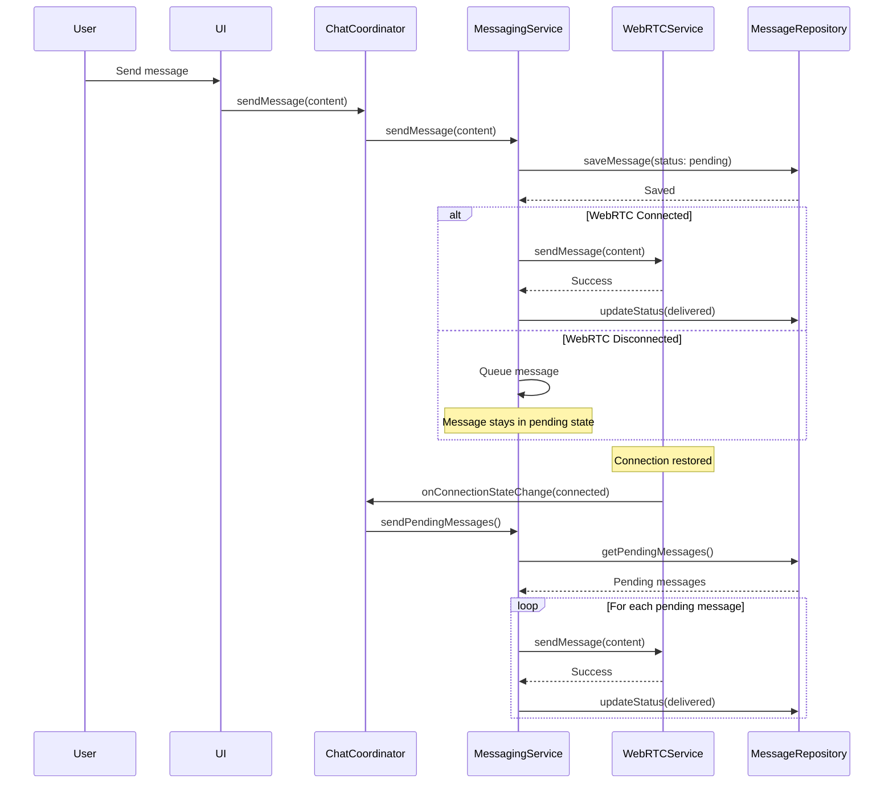
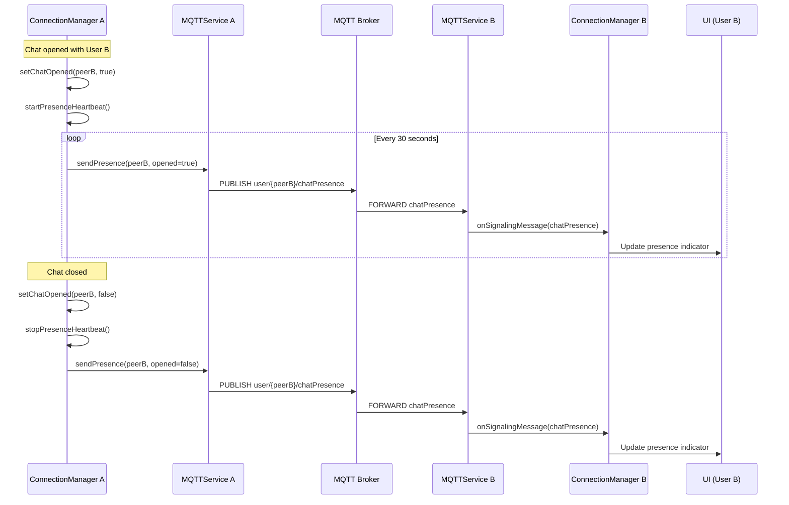
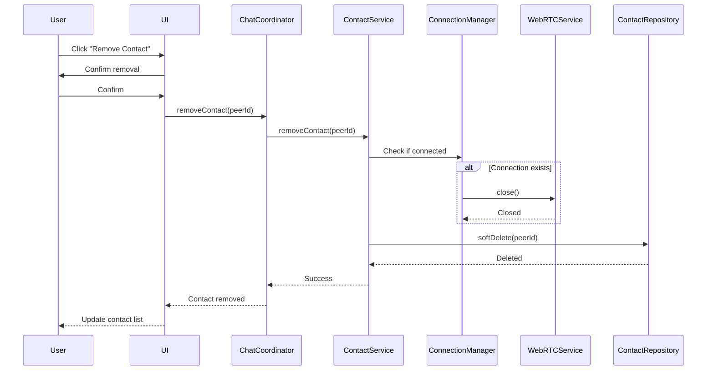

# Sequence Diagrams

## 1. User Login and Initialization

## 2. Add Contact Flow

## 3. Accept Contact and Establish Connection

## 4. Send Message Flow

## 5. Connection Failure and Reconnection

## 6. Message Persistence and Offline Queue

## 7. Presence and Heartbeat

## 8. Contact Removal

## Key Observations

1. **Asynchronous Communication**: All operations are asynchronous with proper error handling
2. **State Management**: Each service maintains its own state and notifies observers
3. **Retry Logic**: Built-in retry mechanisms with exponential backoff
4. **Message Persistence**: All messages are persisted locally before transmission
5. **Connection Resilience**: Automatic reconnection on failure
6. **Presence Awareness**: Heartbeat mechanism to track user presence
