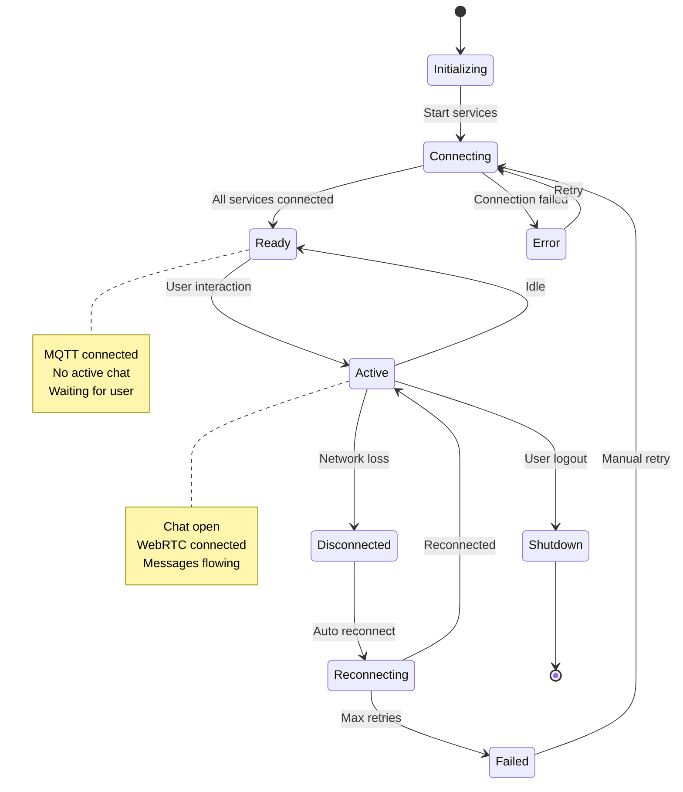
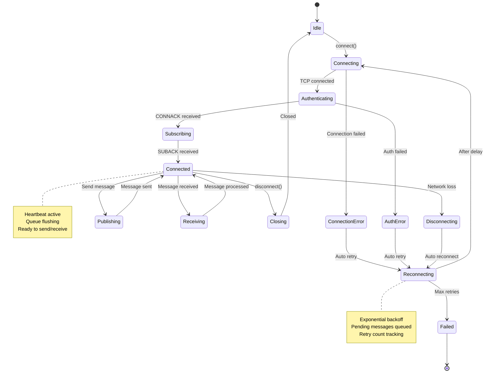
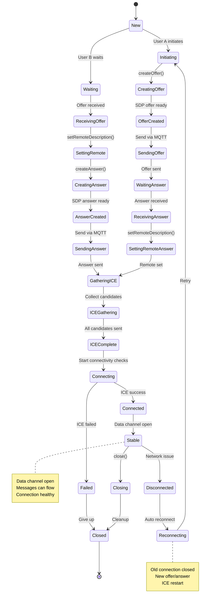
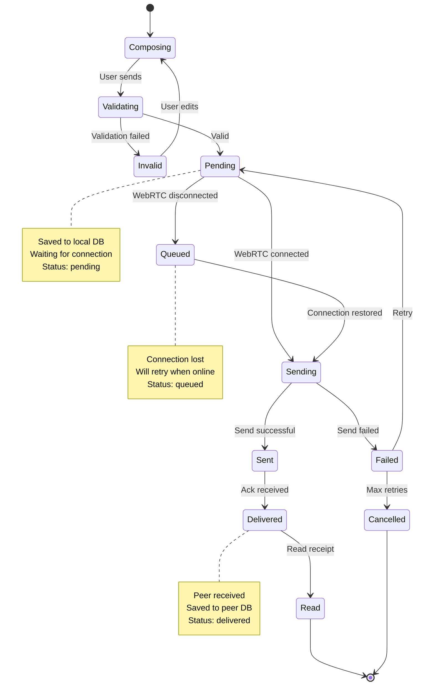
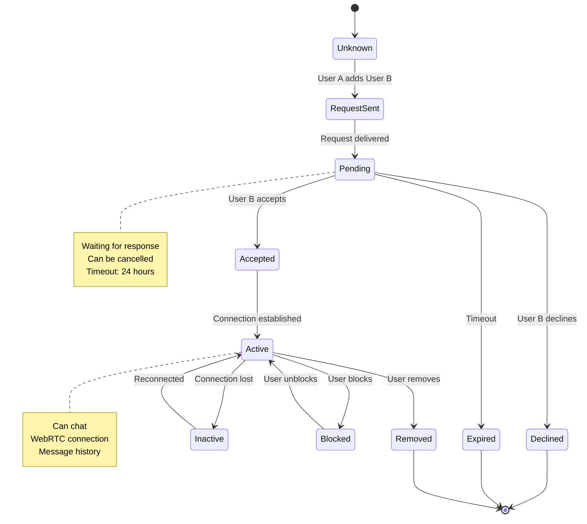
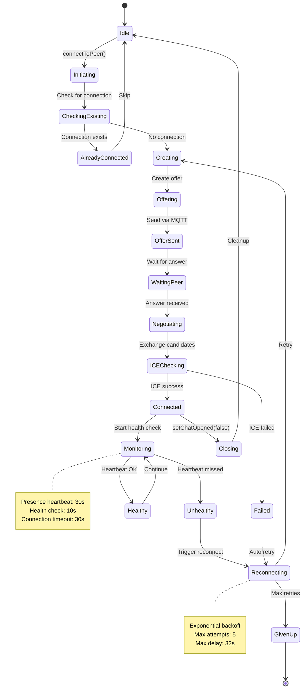
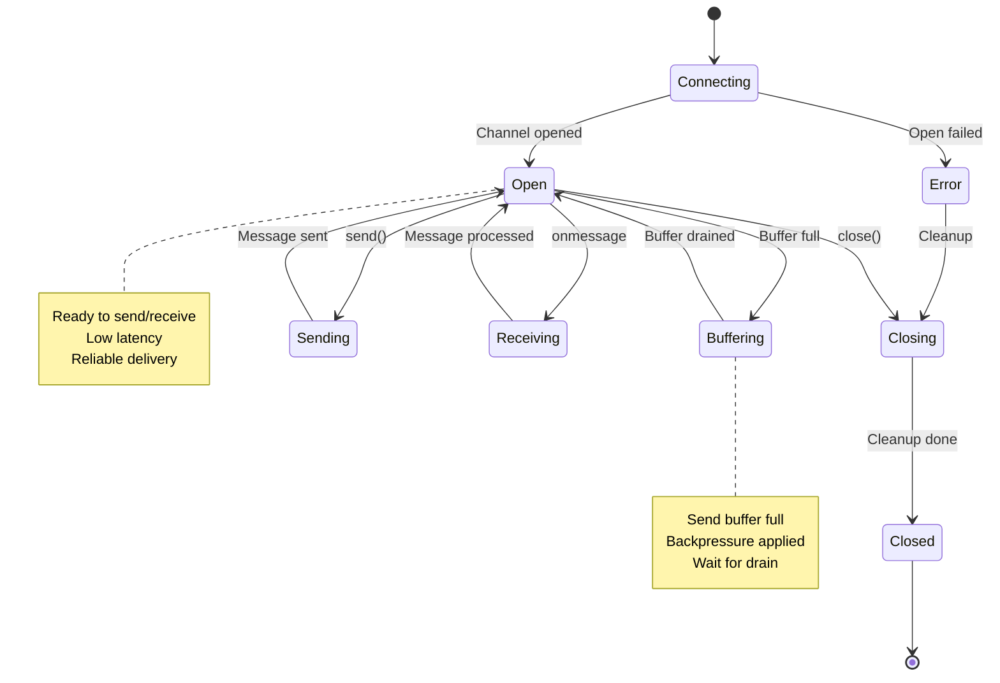
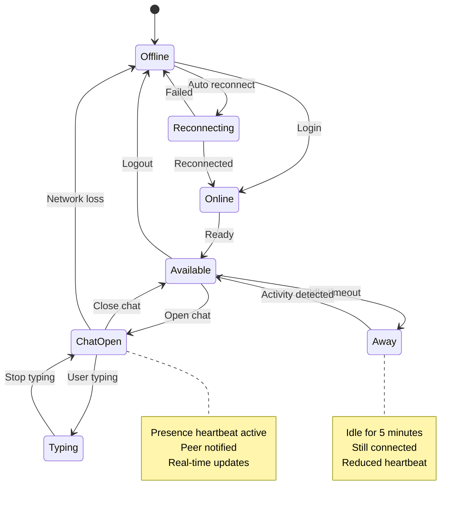
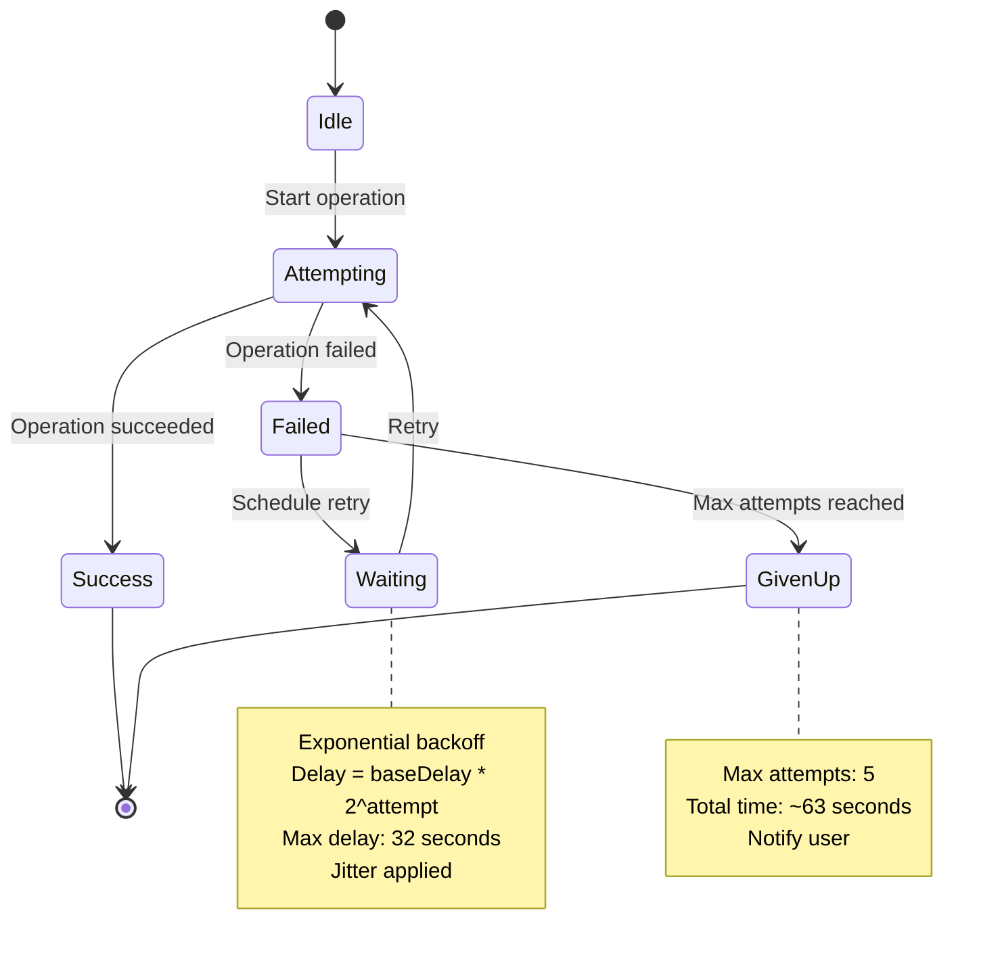
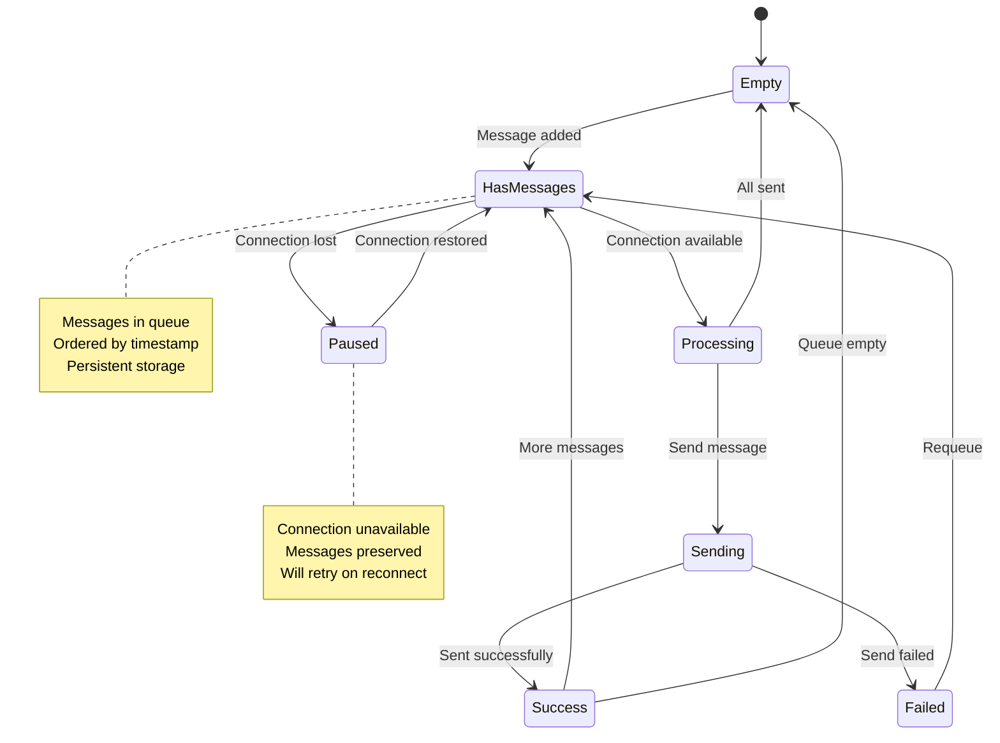

# State Diagrams

## 1. Application State Machine

## 2. MQTT Service State

## 3. WebRTC Connection State

## 4. Message State

## 5. Contact State

## 6. Connection Manager State

## 7. Data Channel State

## 8. Presence State

## 9. Retry State Machine

## 10. Message Queue State

## State Transition Summary

### Critical State Transitions

1. **Initialization Flow**
   - `Idle` -> `Connecting` -> `Ready` -> `Active`

2. **Connection Establishment**
   - `New` -> `Initiating` -> `Connecting` -> `Connected` -> `Stable`

3. **Disconnection Recovery**
   - `Connected` -> `Disconnected` -> `Reconnecting` -> `Connected`

4. **Message Delivery**
   - `Composing` -> `Pending` -> `Sending` -> `Sent` -> `Delivered`

5. **Contact Management**
   - `Unknown` -> `RequestSent` -> `Pending` -> `Accepted` -> `Active`

### Error States

- **Connection Error**: Triggers automatic retry with exponential backoff
- **Authentication Error**: Requires user intervention
- **ICE Failed**: Attempts reconnection with ICE restart
- **Max Retries**: Transitions to failed state, user notification

### Recovery Mechanisms

1. **Automatic Reconnection**: For transient network issues
2. **Exponential Backoff**: Prevents server overload
3. **State Persistence**: Maintains state across reconnections
4. **Queue Management**: Preserves messages during disconnection
5. **Health Monitoring**: Proactive detection of issues
