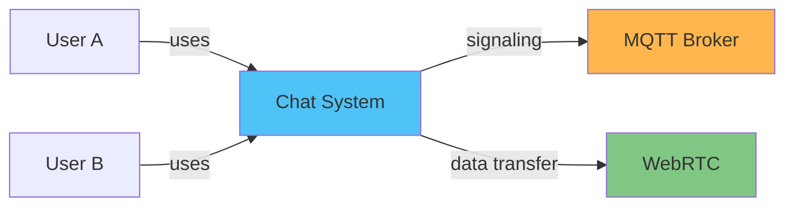

# Use Case Diagram

## System Actors

1. **User A**: Primary user of the chat application
2. **User B**: Peer user communicating with User A
3. **MQTT Broker**: Signaling server for connection establishment
4. **WebRTC**: Peer-to-peer communication infrastructure

## Use Cases

```mermaid
graph TB
    subgraph "Chat Application System"
        UC1["Register/Login"]
        UC2["Add Contact"]
        UC3["Accept Contact Request"]
        UC4["Decline Contact Request"]
        UC5["Remove Contact"]
        UC6["Send Message"]
        UC7["Receive Message"]
        UC8["View Message History"]
        UC9["Establish P2P Connection"]
        UC10["Monitor Connection Status"]
        UC11["Reconnect on Failure"]
        UC12["View Contact List"]
        UC13["Search Contacts"]
    end
    
    UserA("(User A"))
    UserB("(User B"))
    MQTT["MQTT Broker"]
    WebRTC[WebRTC]
    
    UserA --> UC1
    UserA --> UC2
    UserA --> UC3
    UserA --> UC4
    UserA --> UC5
    UserA --> UC6
    UserA --> UC7
    UserA --> UC8
    UserA --> UC12
    UserA --> UC13
    
    UserB --> UC1
    UserB --> UC2
    UserB --> UC6
    UserB --> UC7
    
    UC2 -.-> UC9
    UC3 -.-> UC9
    UC6 -.-> UC9
    
    UC9 --> MQTT
    UC9 --> WebRTC
    UC10 --> WebRTC
    UC11 --> MQTT
    UC11 --> WebRTC
    
    style UC1 fill:#e1f5ff
    style UC2 fill:#e1f5ff
    style UC6 fill:#c8e6c9
    style UC7 fill:#c8e6c9
    style UC9 fill:#fff9c4
    style UC10 fill:#fff9c4
    style UC11 fill:#ffccbc
```

## Use Case Descriptions

### UC1: Register/Login
- **Actor**: User
- **Description**: User enters their unique ID to join the chat system
- **Preconditions**: None
- **Postconditions**: User is connected to MQTT broker and ready to chat
- **Flow**:
  1. User enters unique user ID
  2. System validates ID format
  3. System connects to MQTT broker
  4. System subscribes to user's topic
  5. User is marked as online

### UC2: Add Contact
- **Actor**: User A
- **Description**: User A sends a contact request to User B
- **Preconditions**: User A is logged in
- **Postconditions**: Contact request is sent to User B
- **Flow**:
  1. User A enters peer ID and name
  2. System validates peer ID
  3. System sends contact request via MQTT
  4. Contact is added with "pending" status
  5. System waits for response

### UC3: Accept Contact Request
- **Actor**: User B
- **Description**: User B accepts a contact request from User A
- **Preconditions**: User B has received a contact request
- **Postconditions**: Both users have each other as contacts
- **Flow**:
  1. User B views contact request
  2. User B clicks accept
  3. System sends acceptance via MQTT
  4. Contact is added to both users' lists
  5. System initiates WebRTC connection

### UC4: Decline Contact Request
- **Actor**: User B
- **Description**: User B declines a contact request
- **Preconditions**: User B has received a contact request
- **Postconditions**: Request is rejected
- **Flow**:
  1. User B views contact request
  2. User B clicks decline
  3. System sends rejection via MQTT
  4. Request is removed from User A's pending list

### UC5: Remove Contact
- **Actor**: User
- **Description**: User removes a contact from their list
- **Preconditions**: Contact exists in user's list
- **Postconditions**: Contact is removed, connection is closed
- **Flow**:
  1. User selects contact to remove
  2. User confirms removal
  3. System closes WebRTC connection
  4. System performs soft delete on contact
  5. Contact is removed from UI

### UC6: Send Message
- **Actor**: User A
- **Description**: User A sends a message to User B
- **Preconditions**: WebRTC connection is established
- **Postconditions**: Message is delivered and persisted
- **Flow**:
  1. User A types message
  2. User A presses send
  3. System sends via WebRTC data channel
  4. System saves to local database
  5. Message appears in chat
  6. Delivery status is updated

### UC7: Receive Message
- **Actor**: User B
- **Description**: User B receives a message from User A
- **Preconditions**: WebRTC connection is established
- **Postconditions**: Message is received and persisted
- **Flow**:
  1. System receives data via WebRTC
  2. System parses message
  3. System saves to local database
  4. System displays in chat UI
  5. System sends delivery acknowledgment

### UC8: View Message History
- **Actor**: User
- **Description**: User views previous messages with a contact
- **Preconditions**: User has selected a contact
- **Postconditions**: Message history is displayed
- **Flow**:
  1. User selects contact
  2. System queries local database
  3. System retrieves messages
  4. System displays in chronological order
  5. System auto-scrolls to latest

### UC9: Establish P2P Connection
- **Actor**: System
- **Description**: System establishes WebRTC connection between peers
- **Preconditions**: Both users are online and have accepted contact
- **Postconditions**: WebRTC data channel is open
- **Flow**:
  1. System determines initiator (polite peer pattern)
  2. Initiator creates offer
  3. Offer is sent via MQTT
  4. Receiver creates answer
  5. Answer is sent via MQTT
  6. ICE candidates are exchanged
  7. Connection is established
  8. Data channel opens

### UC10: Monitor Connection Status
- **Actor**: System
- **Description**: System continuously monitors connection health
- **Preconditions**: Connection is established
- **Postconditions**: Connection status is up-to-date
- **Flow**:
  1. System monitors WebRTC connection state
  2. System sends periodic heartbeats
  3. System updates UI status indicator
  4. System detects disconnections
  5. System triggers reconnection if needed

### UC11: Reconnect on Failure
- **Actor**: System
- **Description**: System automatically reconnects after connection failure
- **Preconditions**: Connection has failed
- **Postconditions**: Connection is re-established or max retries reached
- **Flow**:
  1. System detects connection failure
  2. System updates status to "reconnecting"
  3. System attempts reconnection with exponential backoff
  4. System re-establishes MQTT connection
  5. System re-establishes WebRTC connection
  6. System flushes pending messages
  7. System updates status to "connected"

### UC12: View Contact List
- **Actor**: User
- **Description**: User views their list of contacts
- **Preconditions**: User is logged in
- **Postconditions**: Contact list is displayed
- **Flow**:
  1. User opens application
  2. System queries contact repository
  3. System retrieves all contacts
  4. System displays in sidebar
  5. System shows connection status for each

### UC13: Search Contacts
- **Actor**: User
- **Description**: User searches for a specific contact
- **Preconditions**: User has contacts
- **Postconditions**: Filtered contact list is shown
- **Flow**:
  1. User enters search term
  2. System filters contact list
  3. System displays matching contacts
  4. User can select from results

## Actor Relationships



## Use Case Priorities

### High Priority (MVP)
- UC1: Register/Login
- UC6: Send Message
- UC7: Receive Message
- UC9: Establish P2P Connection

### Medium Priority
- UC2: Add Contact
- UC3: Accept Contact Request
- UC8: View Message History
- UC10: Monitor Connection Status

### Low Priority (Nice to Have)
- UC4: Decline Contact Request
- UC5: Remove Contact
- UC11: Reconnect on Failure
- UC12: View Contact List
- UC13: Search Contacts
