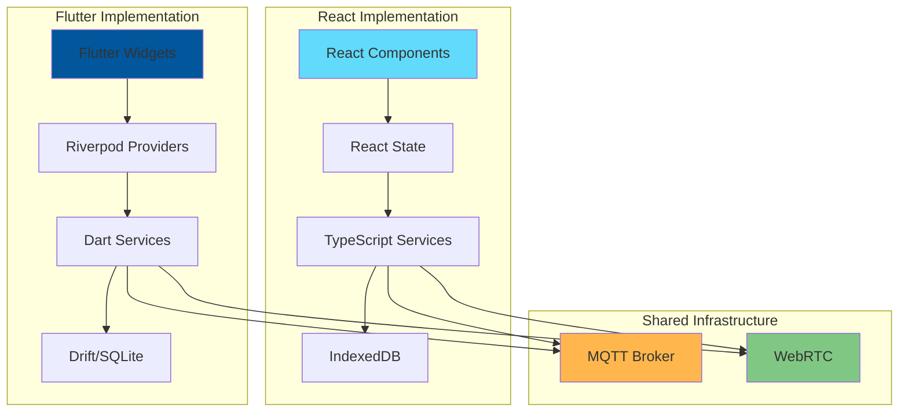
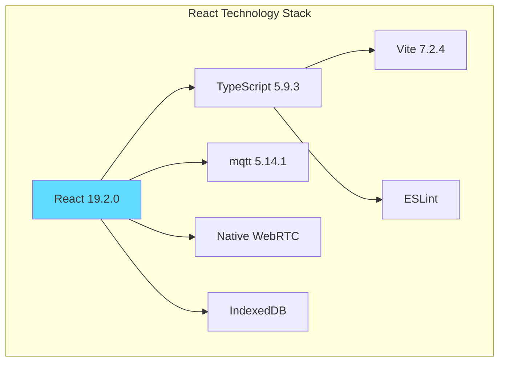
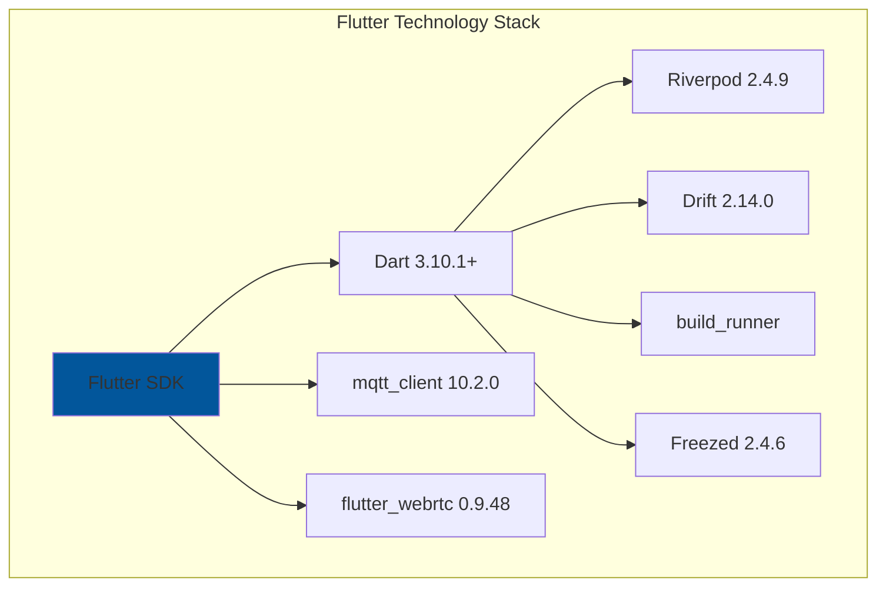

# Cross-Project Comparison: React vs Flutter P2P Chat

## Overview

This document compares the React and Flutter implementations of the P2P chat application, highlighting similarities, differences, and platform-specific considerations.

## Architecture Comparison

### High-Level Architecture



## Feature Comparison Matrix

| Feature | React | Flutter | Notes |
|---------|-------|---------|-------|
| **Platform Support** | Web, Desktop (Electron) | Android, iOS, Web, Linux, Windows, macOS | Flutter has broader native support |
| **UI Framework** | React 19.2.0 | Flutter SDK | Both component-based |
| **Language** | TypeScript 5.9.3 | Dart 3.10.1+ | Both type-safe |
| **State Management** | React State/Context | Riverpod 2.4.9 | Flutter more structured |
| **Database** | IndexedDB | Drift (SQLite) | Flutter more powerful |
| **MQTT Client** | mqtt 5.14.1 | mqtt_client 10.2.0 | Similar functionality |
| **WebRTC** | Native WebRTC API | flutter_webrtc 0.9.48 | Flutter uses wrapper |
| **Build Tool** | Vite 7.2.4 | Flutter CLI | Different ecosystems |
| **Hot Reload** | HMR via Vite | Flutter Hot Reload | Both support fast iteration |
| **Code Generation** | None | build_runner | Flutter more code gen |
| **Package Manager** | npm | pub | Different ecosystems |
| **Testing** | Jest/Vitest | flutter_test | Platform-specific |

## Technology Stack Comparison

### React Stack



### Flutter Stack



## Service Layer Comparison

### React Services

```typescript
// React: Interface-based services
interface IChatCoordinator {
  initialize(): Promise<void>;
  sendMessage(content: string): Promise<void>;
  selectContact(contact: Contact): Promise<void>;
  addContact(peerId: string, name: string): Promise<boolean>;
  dispose(): void;
}

class ChatCoordinator implements IChatCoordinator {
  constructor(
    private signalingService: ISignalingService,
    private webrtcService: IWebRTCService,
    private messageRepository: IMessageRepository,
    private contactRepository: IContactRepository,
    private connectionManager: IConnectionManager,
    private messagingService: IMessageService,
    private contactService: IContactService,
    private userId: string
  ) {}
  
  // Implementation...
}
```

### Flutter Services

```dart
// Flutter: Abstract class-based interfaces
abstract class IChatCoordinator {
  Future<bool> initialize();
  Future<void> sendMessage(String content);
  Future<void> selectContact(Contact contact);
  Future<bool> addContact(String peerId, String name);
  Future<void> dispose();
  String get userId;
}

class ChatCoordinator implements IChatCoordinator {
  final ISignalingService _signalingService;
  final IWebRTCService _webrtcService;
  final IMessageRepository _messageRepository;
  final IContactRepository _contactRepository;
  final IConnectionManager _connectionManager;
  final IMessagingService _messagingService;
  final IContactService _contactService;
  final String _userId;
  
  ChatCoordinator({
    required ISignalingService signalingService,
    required IWebRTCService webrtcService,
    required IMessageRepository messageRepository,
    required IContactRepository contactRepository,
    required IConnectionManager connectionManager,
    required IMessagingService messagingService,
    required IContactService contactService,
    required String userId,
  }) : _signalingService = signalingService,
       _webrtcService = webrtcService,
       _messageRepository = messageRepository,
       _contactRepository = contactRepository,
       _connectionManager = connectionManager,
       _messagingService = messagingService,
       _contactService = contactService,
       _userId = userId;
  
  // Implementation...
}
```

## State Management Comparison

### React State Management

```typescript
// React: useState and Context
const ChatApp: React.FC = () => {
  const [contacts, setContacts] = useState<Contact[]>([]);
  const [selectedContact, setSelectedContact] = useState<Contact | null>(null);
  const [messages, setMessages] = useState<Message[]>([]);
  const [connectionStatus, setConnectionStatus] = useState<string>('Disconnected');
  
  useEffect(() => {
    // Initialize coordinator
    coordinator.initialize();
    
    // Setup event listeners
    coordinator.onMessageReceived((message) => {
      setMessages(prev => [...prev, message]);
    });
    
    coordinator.onConnectionStateChange((status) => {
      setConnectionStatus(status);
    });
    
    return () => coordinator.dispose();
  }, []);
  
  return (
    <div className="chat-app">
      <Sidebar 
        contacts={contacts}
        selectedContact={selectedContact}
        onSelectContact={setSelectedContact}
      />
      <ChatArea
        messages={messages}
        connectionStatus={connectionStatus}
        onSendMessage={(content) => coordinator.sendMessage(content)}
      />
    </div>
  );
};
```

### Flutter State Management (Riverpod)

```dart
// Flutter: Riverpod providers
final contactsProvider = StreamProvider<List<Contact>>((ref) {
  final repo = ref.watch(contactRepositoryProvider);
  return repo.watchAll();
});

final messagesProvider = StreamProvider.family<List<Message>, String>((ref, contactId) {
  final repo = ref.watch(messageRepositoryProvider);
  return repo.watchMessages(contactId);
});

final connectionStatusProvider = StateProvider<String>((ref) => 'Disconnected');

class ChatView extends ConsumerWidget {
  @override
  Widget build(BuildContext context, WidgetRef ref) {
    final contacts = ref.watch(contactsProvider);
    final selectedContact = ref.watch(selectedContactProvider);
    final messages = ref.watch(messagesProvider(selectedContact?.id ?? ''));
    final connectionStatus = ref.watch(connectionStatusProvider);
    
    return Row(
      children: [
        Sidebar(
          contacts: contacts,
          selectedContact: selectedContact,
          onSelectContact: (contact) {
            ref.read(selectedContactProvider.notifier).state = contact;
          },
        ),
        Expanded(
          child: ChatArea(
            messages: messages,
            connectionStatus: connectionStatus,
            onSendMessage: (content) {
              ref.read(coordinatorProvider).sendMessage(content);
            },
          ),
        ),
      ],
    );
  }
}
```

## Database Comparison

### React: IndexedDB

```typescript
// React: IndexedDB with manual schema
class MessageRepository implements IMessageRepository {
  private db: IDBDatabase | null = null;
  
  async initialize(): Promise<void> {
    return new Promise((resolve, reject) => {
      const request = indexedDB.open('ChatDB', 1);
      
      request.onupgradeneeded = (event) => {
        const db = (event.target as IDBOpenDBRequest).result;
        
        if (!db.objectStoreNames.contains('messages')) {
          const store = db.createObjectStore('messages', { keyPath: 'id' });
          store.createIndex('contactId', 'contactId', { unique: false });
          store.createIndex('timestamp', 'timestamp', { unique: false });
        }
      };
      
      request.onsuccess = (event) => {
        this.db = (event.target as IDBOpenDBRequest).result;
        resolve();
      };
      
      request.onerror = () => reject(request.error);
    });
  }
  
  async saveMessage(userId: string, contactId: string, message: Message): Promise<void> {
    const transaction = this.db!.transaction(['messages'], 'readwrite');
    const store = transaction.objectStore('messages');
    await store.add({ ...message, userId, contactId });
  }
}
```

### Flutter: Drift (Type-Safe SQL)

```dart
// Flutter: Drift with compile-time SQL verification
@DriftDatabase(tables: [Messages, Contacts])
class AppDatabase extends _$AppDatabase {
  AppDatabase(QueryExecutor e) : super(e);
  
  @override
  int get schemaVersion => 1;
}

@DataClassName('MessageData')
class Messages extends Table {
  TextColumn get id => text()();
  TextColumn get userId => text()();
  TextColumn get contactId => text()();
  TextColumn get content => text()();
  DateTimeColumn get timestamp => dateTime()();
  BoolColumn get isSent => boolean()();
  TextColumn get status => text()();
  
  @override
  Set<Column> get primaryKey => {id};
}

class MessageRepository implements IMessageRepository {
  final AppDatabase _db;
  
  MessageRepository(this._db);
  
  Future<void> saveMessage(
    String userId,
    String contactId,
    Message message,
  ) async {
    await _db.into(_db.messages).insert(
      MessagesCompanion.insert(
        id: message.id,
        userId: userId,
        contactId: contactId,
        content: message.content,
        timestamp: message.timestamp,
        isSent: message.isSent,
        status: message.status.toString(),
      ),
    );
  }
  
  // Reactive queries
  Stream<List<Message>> watchMessages(String userId, String contactId) {
    return (_db.select(_db.messages)
      ..where((m) => m.userId.equals(userId) & m.contactId.equals(contactId))
      ..orderBy([(m) => OrderingTerm.asc(m.timestamp)]))
      .watch()
      .map((rows) => rows.map((row) => _toMessage(row)).toList());
  }
}
```

## WebRTC Implementation Comparison

### React WebRTC

```typescript
// React: Direct WebRTC API usage
class WebRTCService implements IWebRTCService {
  private peerConnection: RTCPeerConnection | null = null;
  private dataChannel: RTCDataChannel | null = null;
  
  async createOffer(): Promise<RTCSessionDescriptionInit> {
    const offer = await this.peerConnection!.createOffer();
    await this.peerConnection!.setLocalDescription(offer);
    return offer;
  }
  
  async setRemoteDescription(description: RTCSessionDescriptionInit): Promise<void> {
    await this.peerConnection!.setRemoteDescription(
      new RTCSessionDescription(description)
    );
  }
  
  async addIceCandidate(candidate: RTCIceCandidateInit): Promise<void> {
    await this.peerConnection!.addCandidate(new RTCIceCandidate(candidate));
  }
  
  sendMessage(content: string): void {
    if (this.dataChannel?.readyState === 'open') {
      this.dataChannel.send(content);
    }
  }
}
```

### Flutter WebRTC

```dart
// Flutter: flutter_webrtc package wrapper
class WebRtcService implements IWebRTCService {
  RTCPeerConnection? _peerConnection;
  RTCDataChannel? _dataChannel;
  final List<RTCIceCandidate> _pendingCandidates = [];
  
  Future<dynamic> createOffer() async {
    final offer = await _peerConnection!.createOffer();
    await _peerConnection!.setLocalDescription(offer);
    return offer.toMap();
  }
  
  Future<void> setRemoteDescription(dynamic description) async {
    final desc = RTCSessionDescription(
      description['sdp'],
      description['type'],
    );
    await _peerConnection!.setRemoteDescription(desc);
    await _drainPendingCandidates();
  }
  
  Future<void> addIceCandidate(dynamic candidate) async {
    if (!_remoteDescriptionSet) {
      _pendingCandidates.add(RTCIceCandidate(
        candidate['candidate'],
        candidate['sdpMid'],
        candidate['sdpMLineIndex'],
      ));
      return;
    }
    
    await _peerConnection!.addCandidate(RTCIceCandidate(
      candidate['candidate'],
      candidate['sdpMid'],
      candidate['sdpMLineIndex'],
    ));
  }
  
  Future<void> sendMessage(String content) async {
    if (_dataChannel?.state == RTCDataChannelState.RTCDataChannelOpen) {
      await _dataChannel!.send(RTCDataChannelMessage(content));
    }
  }
}
```

## Build and Deployment Comparison

### React Build Process

```bash
# Development
npm run dev

# Production build
npm run build

# Preview production build
npm run preview

# Linting
npm run lint

# Type checking
tsc --noEmit
```

### Flutter Build Process

```bash
# Development (hot reload)
flutter run -d <device>

# Production builds
flutter build apk --release          # Android
flutter build ios --release          # iOS
flutter build web --release          # Web
flutter build linux --release        # Linux
flutter build windows --release      # Windows
flutter build macos --release        # macOS

# Code generation
flutter pub run build_runner build --delete-conflicting-outputs

# Testing
flutter test

# Analysis
flutter analyze
```

## Performance Comparison

| Aspect | React | Flutter | Winner |
|--------|-------|---------|--------|
| **Initial Load** | Fast (web) | Slower (native) | React (web) |
| **Runtime Performance** | Good | Excellent | Flutter |
| **Memory Usage** | Moderate | Low | Flutter |
| **Bundle Size** | Small (web) | Large (native) | React (web) |
| **Hot Reload Speed** | Fast | Very Fast | Flutter |
| **Rendering** | DOM-based | Canvas-based | Flutter |
| **Animation** | CSS/JS | Native | Flutter |
| **Database Performance** | Good | Excellent | Flutter |

## Strengths and Weaknesses

### React Strengths
✅ Excellent web performance
✅ Large ecosystem
✅ Easy deployment (web)
✅ Familiar to web developers
✅ Smaller bundle size (web)
✅ Direct WebRTC API access

### React Weaknesses
[X] Limited to web/Electron
[X] IndexedDB less powerful than SQL
[X] No compile-time SQL verification
[X] Manual state management
[X] Less structured architecture

### Flutter Strengths
✅ True cross-platform (6+ platforms)
✅ Native performance
✅ Type-safe database (Drift)
✅ Structured state management (Riverpod)
✅ Hot reload on all platforms
✅ Consistent UI across platforms
✅ Strong typing with Dart
✅ Code generation support

### Flutter Weaknesses
[X] Larger app size
[X] Steeper learning curve
[X] Smaller ecosystem than React
[X] Web performance not as good as native React
[X] Requires platform-specific setup

## Use Case Recommendations

### Choose React When:
- Target platform is primarily web
- Team has web development experience
- Quick deployment is priority
- Small bundle size is critical
- Integration with existing web infrastructure

### Choose Flutter When:
- Need native mobile apps (Android/iOS)
- Want desktop apps (Linux/Windows/macOS)
- Require consistent UI across platforms
- Database performance is critical
- Team prefers structured architecture
- Long-term maintenance is priority

## Conclusion

Both implementations follow the same architectural principles (SOLID, clean architecture) and use the same communication protocols (MQTT + WebRTC). The choice between them depends on:

1. **Target Platforms**: Flutter for mobile/desktop, React for web
2. **Team Expertise**: React for web developers, Flutter for mobile developers
3. **Performance Needs**: Flutter for high-performance native apps
4. **Development Speed**: React for faster web deployment
5. **Maintenance**: Flutter for long-term cross-platform maintenance

Both are excellent choices for building a P2P chat application, with the decision ultimately depending on specific project requirements and constraints.
