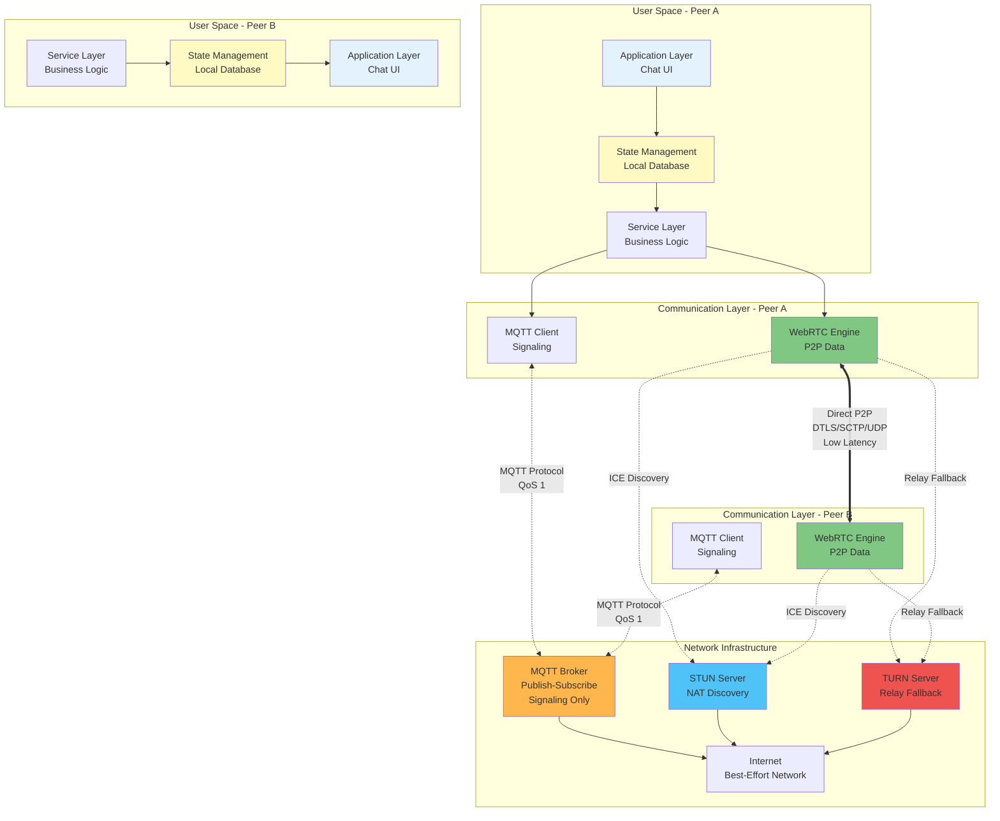
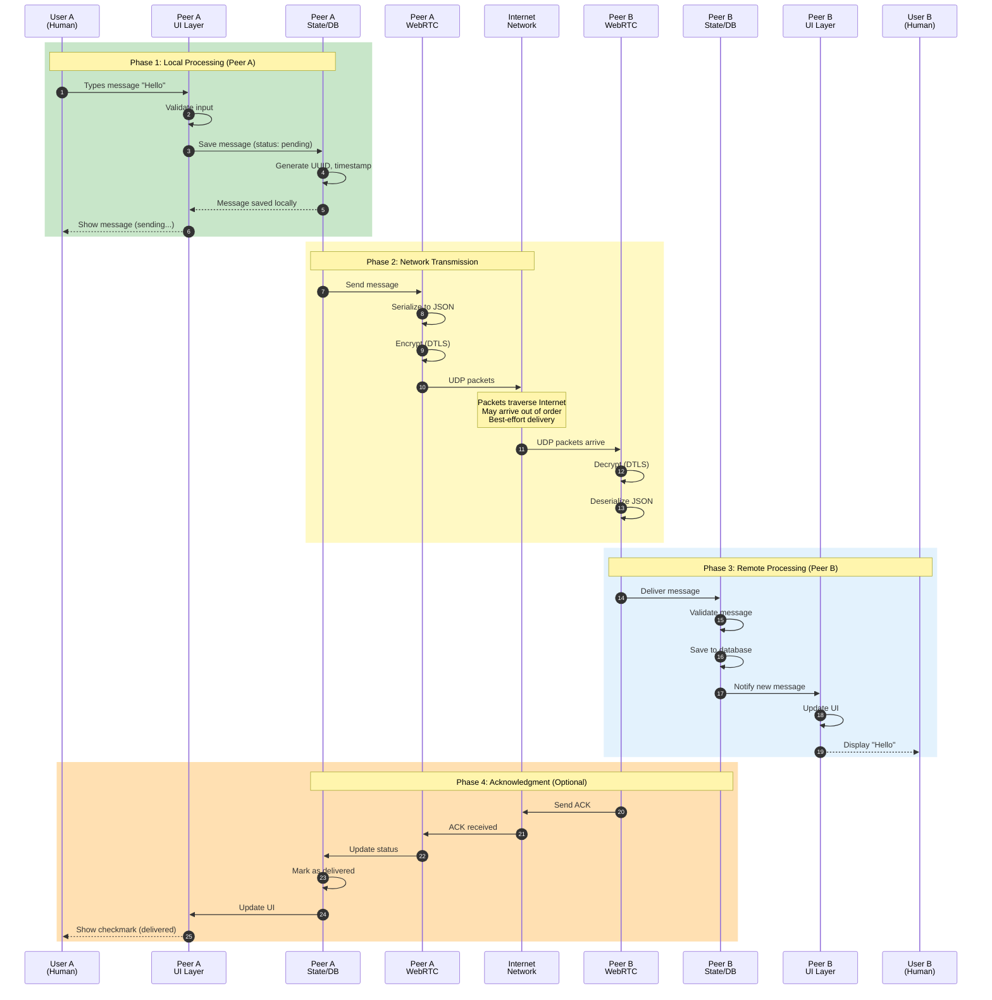
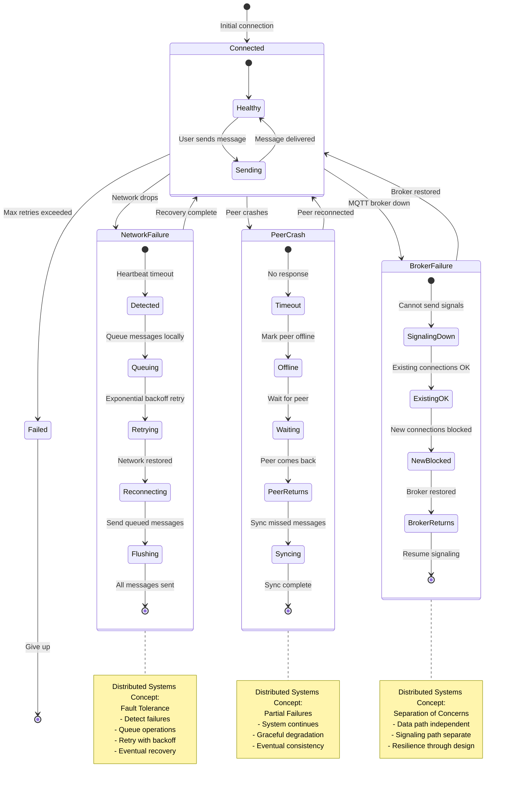
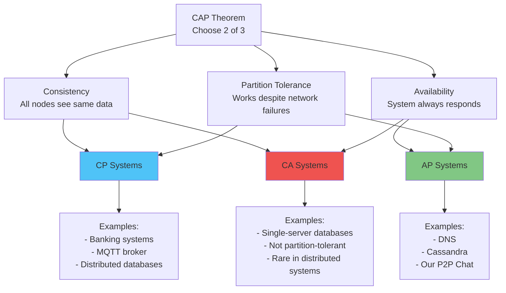
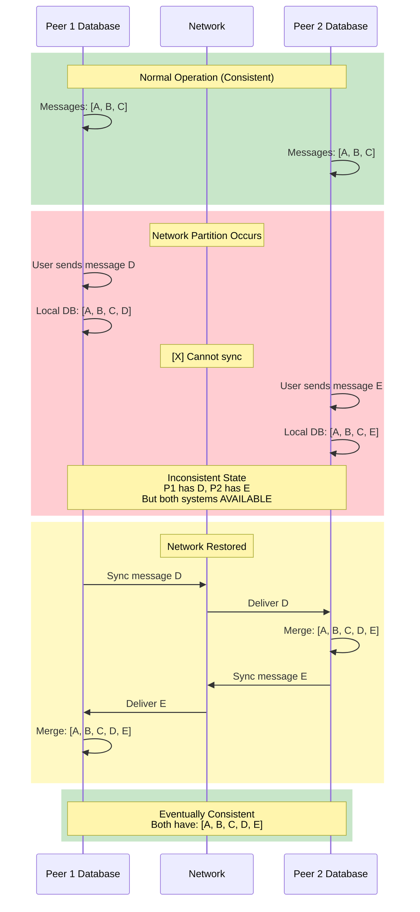
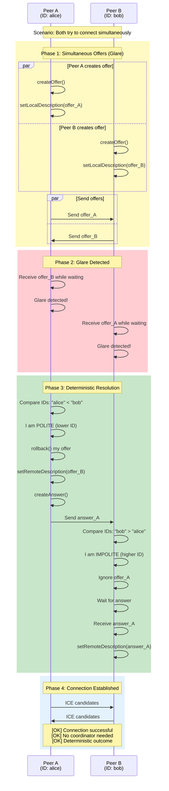

# Distributed Systems Visual Diagrams

## For Postgraduate Students - Visual Learning Guide

This document provides comprehensive visual diagrams to illustrate distributed systems concepts in the P2P chat application.

---

## Diagram 1: System Evolution - Centralized to Distributed

### Evolution of Chat Architectures

```mermaid
graph TB
    subgraph "Generation 1: Centralized (1990s)"
        C1_User1[User 1] --> C1_Server[Central Server<br/>Single Point of Failure]
        C1_User2[User 2] --> C1_Server
        C1_User3[User 3] --> C1_Server
        C1_Server --> C1_DB[(Database)]
        
        C1_Problems[Problems:<br/>- Server bottleneck<br/>- Single point of failure<br/>- High latency<br/>- Privacy concerns<br/>- Scaling costs O(N^2)]
    end
    
    subgraph "Generation 2: Federated (2000s)"
        F1_User1[User 1] --> F1_Server1[Server A]
        F1_User2[User 2] --> F1_Server1
        F1_User3[User 3] --> F1_Server2[Server B]
        F1_User4[User 4] --> F1_Server2
        
        F1_Server1 <--> F1_Server2
        
        F1_Problems[Problems:<br/>- Still server-dependent<br/>- Complex federation<br/>- Trust issues<br/>- Moderate latency]
    end
    
    subgraph "Generation 3: Pure P2P (2010s)"
        P1_User1[User 1] <--> P1_User2[User 2]
        P1_User1 <--> P1_User3[User 3]
        P1_User2 <--> P1_User3
        P1_User2 <--> P1_User4[User 4]
        
        P1_Problems[Problems:<br/>- NAT traversal difficult<br/>- Peer discovery complex<br/>- No guaranteed delivery<br/>- Bootstrap problem]
    end
    
    subgraph "Generation 4: Hybrid P2P (Our Approach - 2020s)"
        H1_User1[User 1] <-->|Data| H1_User2[User 2]
        H1_User1 <-->|Data| H1_User3[User 3]
        H1_User2 <-->|Data| H1_User3
        
        H1_User1 -.->|Signaling| H1_Broker[MQTT Broker<br/>Lightweight]
        H1_User2 -.->|Signaling| H1_Broker
        H1_User3 -.->|Signaling| H1_Broker
        
        H1_Benefits[Benefits:<br/>[OK] Low latency (P2P data)<br/>[OK] Reliable signaling (MQTT)<br/>[OK] NAT traversal (WebRTC)<br/>[OK] Scalable O(N)<br/>[OK] Privacy preserved]
    end
    
    style C1_Server fill:#ef5350
    style F1_Server1 fill:#ff9800
    style F1_Server2 fill:#ff9800
    style H1_Broker fill:#ffb74d
    style H1_User1 fill:#81c784
    style H1_User2 fill:#81c784
    style H1_User3 fill:#81c784
    style H1_Benefits fill:#c8e6c9
```

---

## Diagram 2: Complete Distributed System Architecture

### Layered Architecture with Distributed Components



### Component Responsibilities

| Layer | Component | Distributed Systems Role | CAP Choice |
|-------|-----------|--------------------------|------------|
| **Application** | Chat UI | User interface, local rendering | - |
| **State** | Local Database | Eventually consistent storage | **AP** |
| **Service** | Business Logic | Coordination, message handling | - |
| **Signaling** | MQTT Client | Reliable message delivery | **CP** |
| **Data Transfer** | WebRTC | Low-latency P2P communication | **AP** |
| **Infrastructure** | MQTT Broker | Centralized signaling router | **CP** |
| **Infrastructure** | STUN/TURN | NAT traversal assistance | **AP** |

---

## Diagram 3: Message Flow - Complete Lifecycle

### From User Input to Peer Delivery



### Distributed Systems Concepts Illustrated

1. **Asynchronous Communication** (Steps 1-8): No blocking, local-first
2. **Network Uncertainty** (Steps 9-10): Packets may be lost, reordered
3. **End-to-End Encryption** (Steps 7, 11): Security in untrusted network
4. **Eventually Consistent** (Steps 12-15): Both databases eventually match
5. **Acknowledgment Protocol** (Steps 16-21): Reliability through feedback

---

## Diagram 4: Failure Scenarios and Recovery

### Comprehensive Failure Handling



### Failure Recovery Timeline

```mermaid
gantt
    title Failure Recovery Timeline (Exponential Backoff)
    dateFormat X
    axisFormat %Ss
    
    section Normal Operation
    Connected :active, 0, 5
    
    section Failure Detected
    Failure occurs :crit, 5, 1
    
    section Retry Attempts
    Attempt 1 (1s delay) :retry1, 6, 1
    Wait 1s :7, 1
    Attempt 2 (2s delay) :retry2, 8, 1
    Wait 2s :9, 2
    Attempt 3 (4s delay) :retry3, 11, 1
    Wait 4s :12, 4
    Attempt 4 (8s delay) :retry4, 16, 1
    Wait 8s :17, 8
    Attempt 5 (16s delay) :retry5, 25, 1
    
    section Recovery
    Connection restored :done, 26, 2
    Flush queued messages :done, 28, 3
    Normal operation :active, 31, 5
```



---

## Diagram 5: Scalability Analysis

### Cost Comparison: Centralized vs P2P

```mermaid
graph TB
    subgraph "Centralized Architecture"
        C_Users[N Users]
        C_Server[Central Server]
        C_Connections[N^2 connections through server]
        C_Bandwidth[Server Bandwidth: O(N^2)]
        C_Cost[Monthly Cost: $$$$$]
        
        C_Users --> C_Server
        C_Server --> C_Connections
        C_Connections --> C_Bandwidth
        C_Bandwidth --> C_Cost
        
        C_Example[Example: 1000 users<br/>= 1,000,000 message pairs<br/>= All through server<br/>= Very expensive]
    end
    
    subgraph "P2P Architecture (Our Approach)"
        P_Users[N Users]
        P_Broker[MQTT Broker<br/>Signaling Only]
        P_Direct[Direct P2P Connections]
        P_Bandwidth[Broker Bandwidth: O(N)]
        P_Cost[Monthly Cost: $]
        
        P_Users --> P_Broker
        P_Users --> P_Direct
        P_Broker --> P_Bandwidth
        P_Bandwidth --> P_Cost
        
        P_Example[Example: 1000 users<br/>= 1000 signaling messages<br/>= Data via P2P (free)<br/>= Very cheap]
    end
    
    style C_Cost fill:#ef5350
    style P_Cost fill:#81c784
    style C_Server fill:#ef5350
    style P_Broker fill:#ffb74d
```

### Scaling Metrics

| Users | Centralized Server Load | P2P Broker Load | Cost Ratio |
|-------|-------------------------|-----------------|------------|
| 10 | 100 msg/s | 10 msg/s | 10:1 |
| 100 | 10,000 msg/s | 100 msg/s | 100:1 |
| 1,000 | 1,000,000 msg/s | 1,000 msg/s | 1000:1 |
| 10,000 | 100,000,000 msg/s | 10,000 msg/s | 10000:1 |

**Key Insight**: P2P architecture scales **linearly** O(N) while centralized scales **quadratically** O(N^2)

---

## Diagram 6: CAP Theorem in Practice

### CAP Theorem Trade-offs



### Our Choice: AP (Availability + Partition Tolerance)



**Why AP over CP?**
- ✅ Users can always send messages (Availability)
- ✅ Works during network failures (Partition Tolerance)
- ✅ Messages sync when connection restored (Eventual Consistency)
- [X] Temporary inconsistency acceptable for chat (Trade-off)

---

## Diagram 7: Consensus Without Coordinator

### Polite Peer Pattern (Distributed Consensus)



**Distributed Systems Principles**:
1. **No Central Coordinator**: Peers resolve conflict themselves
2. **Deterministic**: Same inputs always produce same outcome
3. **Symmetric Algorithm**: Both peers run same logic
4. **Lexicographic Ordering**: Simple, universal comparison

---

## Diagram 8: Security in Distributed Systems

### End-to-End Security Layers

```mermaid
graph TB
    subgraph "Application Layer"
        PlainText[Plain Text Message<br/>"Hello, World!"]
    end
    
    subgraph "Encryption Layers"
        direction TB
        
        subgraph "WebRTC Security"
            DTLS[DTLS Encryption<br/>TLS 1.2+<br/>AES-128-GCM]
            SRTP[SRTP for Media<br/>AES encryption]
        end
        
        subgraph "MQTT Security"
            TLS[TLS/WSS<br/>Transport encryption]
            Auth[Authentication<br/>Username/Password]
        end
    end
    
    subgraph "Network Layer"
        Encrypted[Encrypted Packets<br/>Unreadable by intermediaries]
    end
    
    subgraph "Threat Model"
        Eavesdropper[Eavesdropper<br/>[X] Cannot read]
        MITM[Man-in-the-Middle<br/>[X] Cannot modify]
        Replay[Replay Attack<br/>[X] Detected by sequence numbers]
    end
    
    PlainText --> DTLS
    PlainText --> TLS
    
    DTLS --> Encrypted
    SRTP --> Encrypted
    TLS --> Encrypted
    Auth --> TLS
    
    Encrypted -.->|Blocked| Eavesdropper
    Encrypted -.->|Blocked| MITM
    Encrypted -.->|Blocked| Replay
    
    style DTLS fill:#ef5350
    style TLS fill:#ef5350
    style Encrypted fill:#4fc3f7
    style Eavesdropper fill:#bdbdbd
    style MITM fill:#bdbdbd
    style Replay fill:#bdbdbd
```

### Security Properties

| Layer | Protocol | Protection | Distributed Systems Benefit |
|-------|----------|------------|----------------------------|
| **Data Transfer** | DTLS | End-to-end encryption | Privacy in untrusted network |
| **Signaling** | TLS/WSS | Transport encryption | Secure peer discovery |
| **Authentication** | MQTT Auth | Identity verification | Trust establishment |
| **Integrity** | HMAC | Tamper detection | Message authenticity |
| **Replay Protection** | Sequence Numbers | Prevent replay attacks | Temporal ordering |

---

## Summary: Distributed Systems Concepts Demonstrated

### Concept Checklist

| Concept | Implementation | Diagram Reference |
|---------|----------------|-------------------|
| ✅ **Decentralization** | P2P data transfer | Diagram 1, 2 |
| ✅ **Fault Tolerance** | Retry mechanisms | Diagram 4 |
| ✅ **Scalability** | Linear cost growth | Diagram 5 |
| ✅ **Consistency** | Eventual consistency | Diagram 6 |
| ✅ **Consensus** | Polite peer pattern | Diagram 7 |
| ✅ **Security** | End-to-end encryption | Diagram 8 |
| ✅ **Transparency** | NAT traversal | Diagram 2 |
| ✅ **Asynchrony** | Message queuing | Diagram 3 |
| ✅ **Heterogeneity** | Cross-platform | Diagram 2 |
| ✅ **Concurrency** | Multiple connections | Diagram 3 |

### Teaching Points for Students

1. **Hybrid Architectures**: Combining centralized and decentralized approaches
2. **Trade-offs**: CAP theorem in practice (AP over CP)
3. **Protocol Selection**: MQTT for reliability, WebRTC for performance
4. **Failure Handling**: Exponential backoff, graceful degradation
5. **Consensus**: Distributed agreement without coordinator
6. **Scalability**: Linear vs quadratic cost growth
7. **Security**: Defense in depth with multiple layers
8. **Real-World Constraints**: NAT traversal, network uncertainty

---

**For Instructors**: These diagrams can be used in lectures to illustrate distributed systems concepts with a concrete, working example. The P2P chat application demonstrates how theoretical concepts translate into practical systems.
