# Distributed Systems Theory in P2P Chat Application

## Overview for Postgraduate Students

This document explains how distributed systems concepts are employed in the P2P chat application, focusing on theoretical foundations rather than implementation details. It is designed for academic study of distributed systems principles.

---

## 1. Distributed Systems Fundamentals

### What is a Distributed System?

A distributed system is a collection of independent computers that appears to its users as a single coherent system. Key characteristics:

- **Multiple autonomous nodes**: Each peer runs independently
- **Message passing**: Nodes communicate via network messages
- **No shared memory**: Each node has its own local state
- **Concurrent execution**: Multiple operations happen simultaneously
- **Partial failures**: Some nodes can fail while others continue

### P2P Chat as a Distributed System

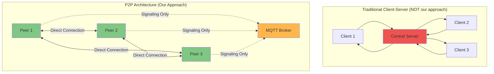

**Key Difference**: In our P2P system, the MQTT broker is only used for **signaling** (connection setup), not for data transfer. Once connected, peers communicate directly.

---

## 2. Distributed Systems Challenges & Solutions

### Challenge 1: Peer Discovery

**Problem**: How do peers find each other in a distributed network?

**Solution**: Publish-Subscribe Pattern via MQTT

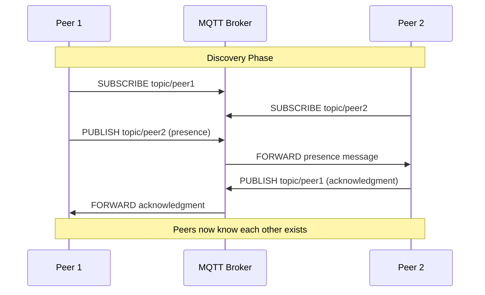

**Distributed Systems Concept**: **Service Discovery** - Using a lightweight broker for peer discovery while maintaining decentralized data transfer.

### Challenge 2: NAT Traversal

**Problem**: Peers are behind NAT/firewalls and cannot directly connect

**NAT (Network Address Translation)** hides internal IP addresses:

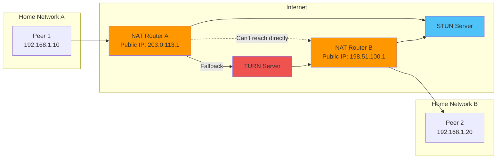

**Solution**: ICE (Interactive Connectivity Establishment)

1. **STUN** (Session Traversal Utilities for NAT): Discovers public IP
2. **TURN** (Traversal Using Relays around NAT): Relay server as fallback
3. **ICE**: Tries multiple connection paths, chooses best one

**Distributed Systems Concept**: **Network Transparency** - Hiding network complexity from the application layer.

### Challenge 3: Consensus on Connection Establishment

**Problem**: What if both peers try to initiate connection simultaneously? (Glare condition)

**Solution**: Polite Peer Pattern

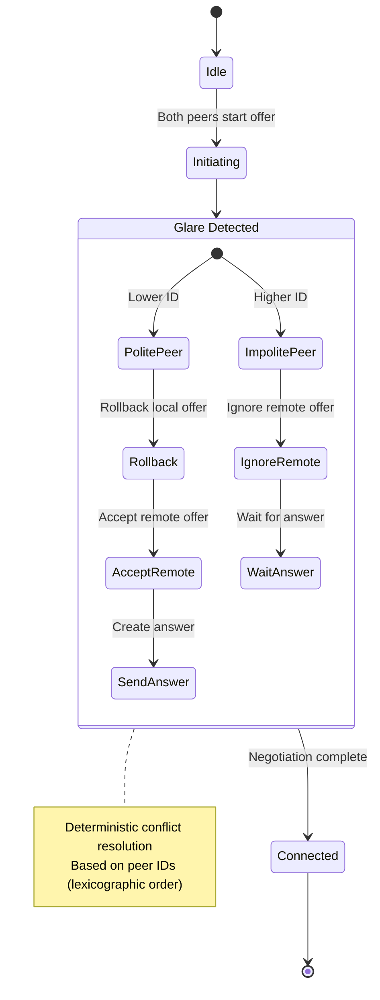

**Distributed Systems Concept**: **Distributed Consensus** - Resolving conflicts without central coordinator using deterministic rules.

### Challenge 4: Message Ordering

**Problem**: Messages can arrive out of order in a distributed system

**Solution**: Logical Timestamps

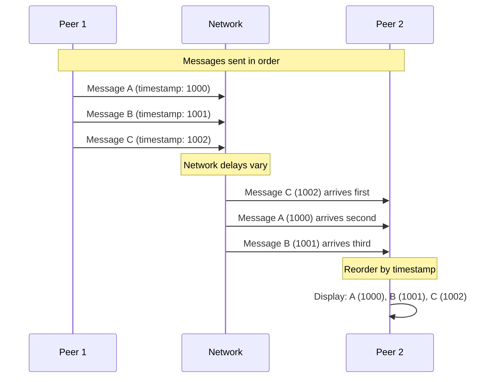

**Distributed Systems Concept**: **Logical Clocks** - Using timestamps to maintain causal ordering without synchronized physical clocks.

### Challenge 5: Fault Tolerance

**Problem**: Network failures, peer crashes, message loss

**Solution**: Retry with Exponential Backoff

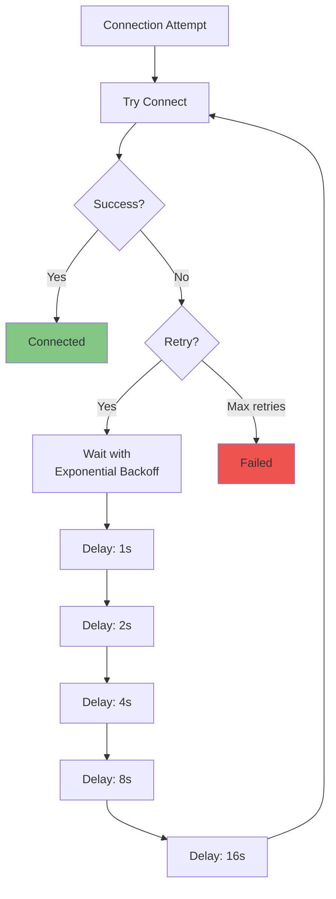

**Distributed Systems Concept**: **Fault Tolerance** - System continues operating despite failures through retry mechanisms and graceful degradation.

---

## 3. WebRTC: Deep Dive

### What is WebRTC?

**WebRTC (Web Real-Time Communication)** is a set of protocols and APIs for peer-to-peer communication.

### WebRTC Architecture

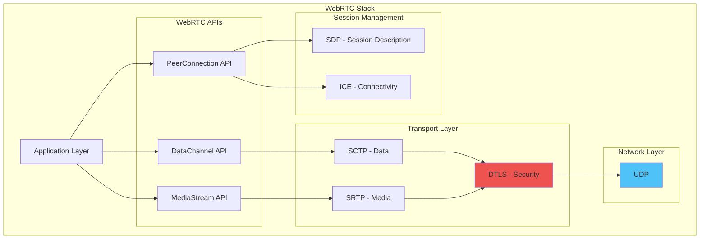

### WebRTC Connection Establishment (SDP Offer/Answer)

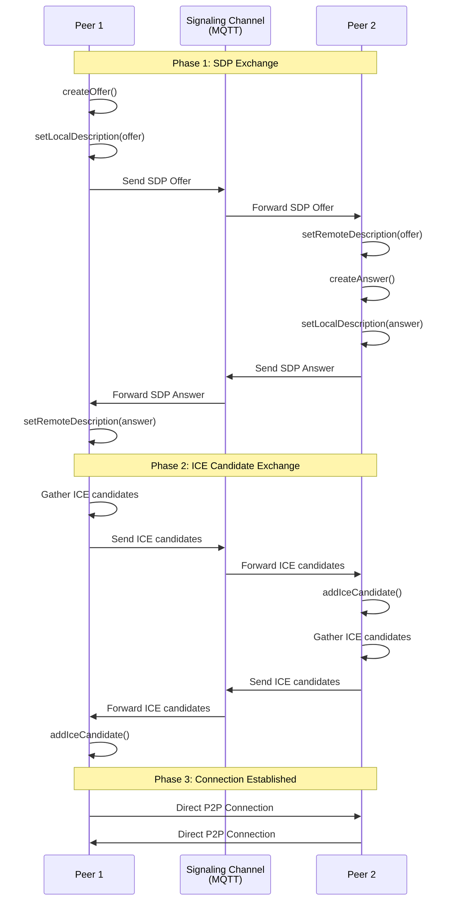

### Why WebRTC for Distributed Systems?

| Feature | Benefit | Distributed Systems Principle |
|---------|---------|-------------------------------|
| **P2P Architecture** | No central server bottleneck | Decentralization |
| **Low Latency** | Direct peer communication | Network Efficiency |
| **NAT Traversal** | Works behind firewalls | Network Transparency |
| **Built-in Security** | DTLS encryption | Security by Design |
| **Adaptive Bitrate** | Adjusts to network conditions | Adaptability |
| **Connection Multiplexing** | Multiple streams over one connection | Resource Efficiency |

---

## 4. MQTT: Deep Dive

### What is MQTT?

**MQTT (Message Queuing Telemetry Transport)** is a lightweight publish-subscribe messaging protocol.

### MQTT Architecture

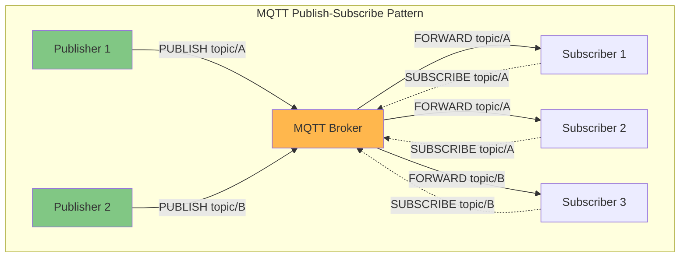

### MQTT Topic Hierarchy

```
user/
├── alice/
│   ├── offer              # WebRTC offers for Alice
│   ├── answer             # WebRTC answers for Alice
│   ├── iceCandidate       # ICE candidates for Alice
│   ├── contactRequest     # Contact requests for Alice
│   └── presence           # Presence updates for Alice
├── bob/
│   ├── offer
│   ├── answer
│   ├── iceCandidate
│   ├── contactRequest
│   └── presence
└── charlie/
    ├── offer
    ├── answer
    ├── iceCandidate
    ├── contactRequest
    └── presence
```

### MQTT Quality of Service (QoS)

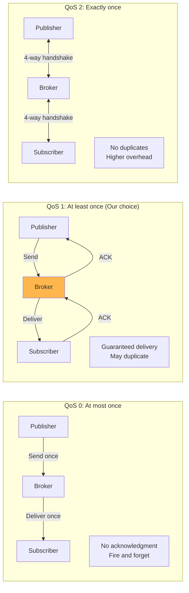

**We use QoS 1** because:
- Signaling messages must be delivered (QoS 0 too unreliable)
- Duplicates are acceptable (WebRTC handles them)
- Lower overhead than QoS 2

### Why MQTT for Distributed Systems?

| Feature | Benefit | Distributed Systems Principle |
|---------|---------|-------------------------------|
| **Publish-Subscribe** | Decoupled communication | Loose Coupling |
| **Lightweight** | Low bandwidth usage | Resource Efficiency |
| **QoS Levels** | Configurable reliability | Adaptability |
| **Persistent Sessions** | Survives disconnections | Fault Tolerance |
| **Last Will Testament** | Detects peer failures | Failure Detection |
| **Topic Hierarchy** | Organized message routing | Scalability |

---

## 5. WebRTC vs MQTT: Comparison

### Architectural Comparison

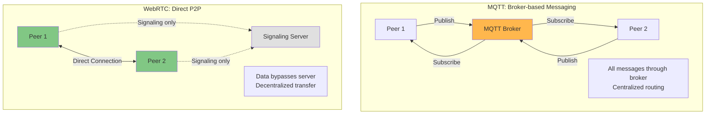

### Feature Comparison

| Aspect | MQTT | WebRTC | Winner |
|--------|------|--------|--------|
| **Architecture** | Broker-based | Peer-to-peer | WebRTC (decentralized) |
| **Latency** | Higher (via broker) | Lower (direct) | WebRTC |
| **Bandwidth** | Efficient (small messages) | High (media streams) | MQTT |
| **Reliability** | QoS guarantees | Best-effort UDP | MQTT |
| **NAT Traversal** | Not needed | Built-in (ICE) | WebRTC |
| **Setup Complexity** | Simple | Complex | MQTT |
| **Scalability** | Broker bottleneck | Mesh complexity | Depends |
| **Use Case** | Signaling, IoT | Real-time media/data | Complementary |

### Why Use Both?

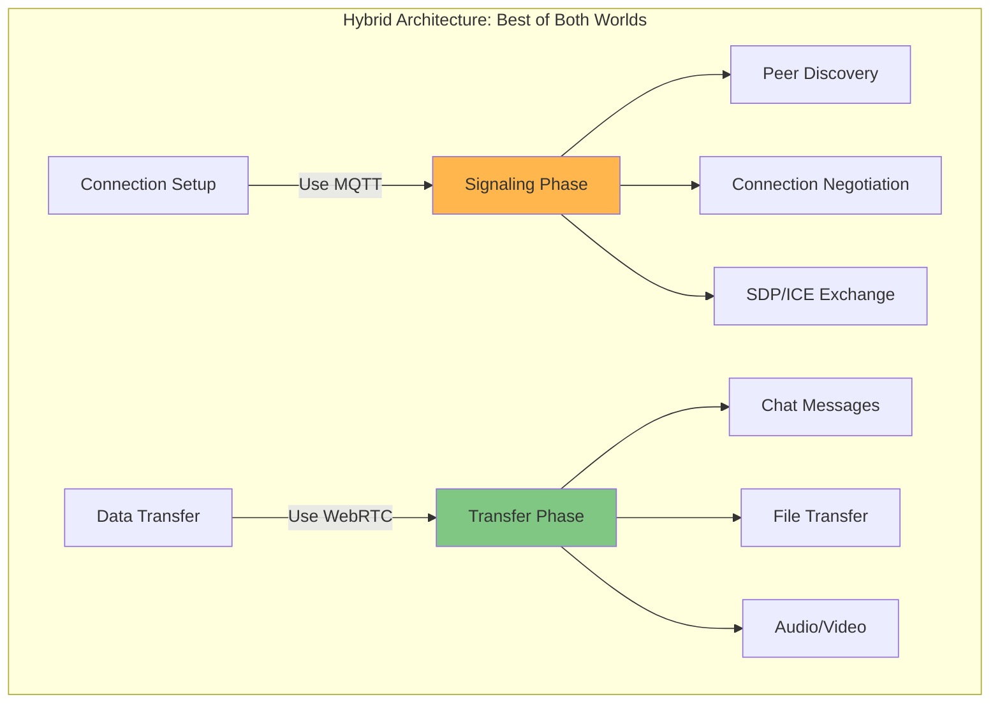

**Rationale**:
1. **MQTT for Signaling**: Reliable, simple, works everywhere
2. **WebRTC for Data**: Low latency, high throughput, P2P efficiency
3. **Separation of Concerns**: Each protocol does what it's best at

---

## 6. Distributed Systems Properties

### CAP Theorem Application

The **CAP Theorem** states you can only have 2 of 3:
- **C**onsistency: All nodes see the same data
- **A**vailability: System always responds
- **P**artition Tolerance: System works despite network failures

**Our P2P Chat System**:

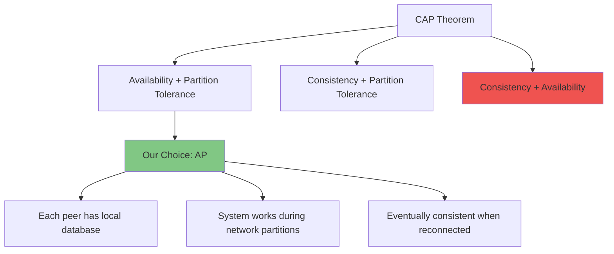

**Trade-off**: We sacrifice **strong consistency** for **availability**. Messages are eventually consistent across peers.

### Eventual Consistency

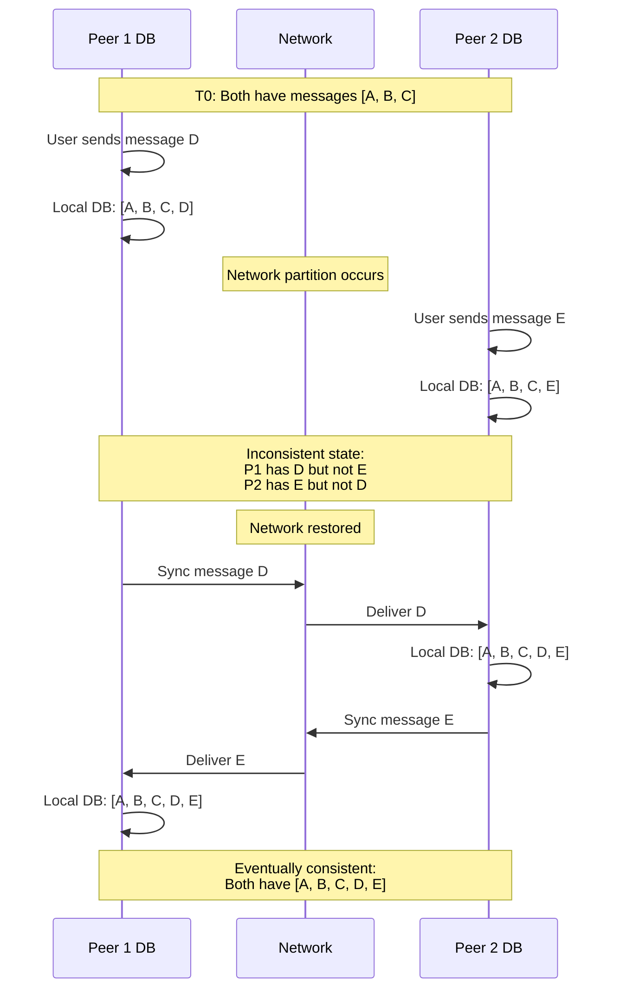

### Failure Models

Our system handles:

1. **Crash Failures**: Peer crashes and stops
   - **Solution**: Reconnection logic, message queuing

2. **Network Failures**: Connection lost
   - **Solution**: Exponential backoff retry, offline mode

3. **Byzantine Failures**: Malicious peers (limited)
   - **Partial Solution**: Message validation, peer authentication

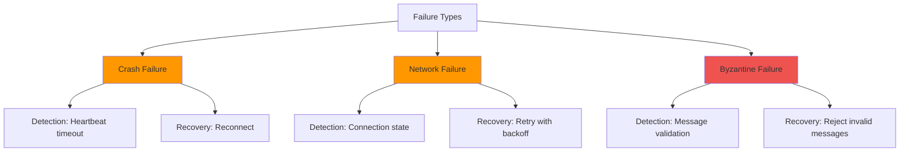

---

## 7. Why Choose This Architecture?

### Design Decisions

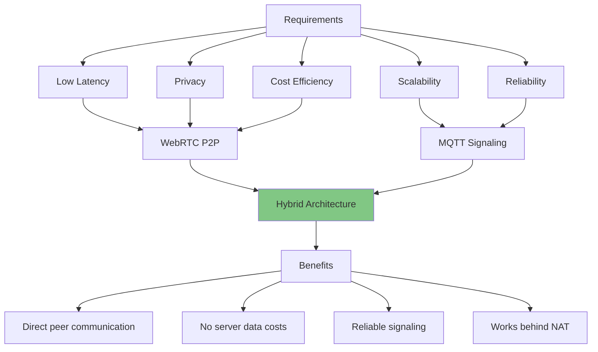

### Alternative Architectures Considered

| Architecture | Pros | Cons | Why Not Chosen |
|--------------|------|------|----------------|
| **Pure Client-Server** | Simple, consistent | Server bottleneck, costs | Poor scalability, privacy |
| **Pure P2P (DHT)** | Fully decentralized | Complex, slow discovery | Complexity outweighs benefits |
| **WebSocket Server** | Real-time, simple | Server costs, single point of failure | Doesn't scale well |
| **Hybrid MQTT+WebRTC** ✅ | Best of both worlds | Moderate complexity | **Chosen for balance** |

### Scalability Analysis

```mermaid
graph LR
    subgraph "Client-Server Scaling"
        CS_Users[N Users]
        CS_Server[Server Load: O(N²)]
        CS_Cost[Cost: O(N²)]
        
        CS_Users --> CS_Server
        CS_Server --> CS_Cost
    end
    
    subgraph "P2P Scaling (Our Approach)"
        P2P_Users[N Users]
        P2P_Broker[Broker Load: O(N)]
        P2P_Cost[Cost: O(N)]
        P2P_Direct[Direct P2P: O(1) per connection]
        
        P2P_Users --> P2P_Broker
        P2P_Broker --> P2P_Cost
        P2P_Users --> P2P_Direct
    end
    
    style CS_Cost fill:#ef5350
    style P2P_Cost fill:#81c784
```

**Key Insight**: MQTT broker only handles signaling (small messages), not data transfer. This keeps costs linear O(N) instead of quadratic O(N²).

---

## 8. Academic Takeaways

### Distributed Systems Principles Demonstrated

1. ✅ **Decentralization**: No single point of failure for data
2. ✅ **Transparency**: Network complexity hidden from users
3. ✅ **Fault Tolerance**: System continues despite failures
4. ✅ **Scalability**: Linear cost growth with users
5. ✅ **Consistency**: Eventually consistent model
6. ✅ **Concurrency**: Multiple simultaneous connections
7. ✅ **Heterogeneity**: Works across different platforms

### Key Lessons

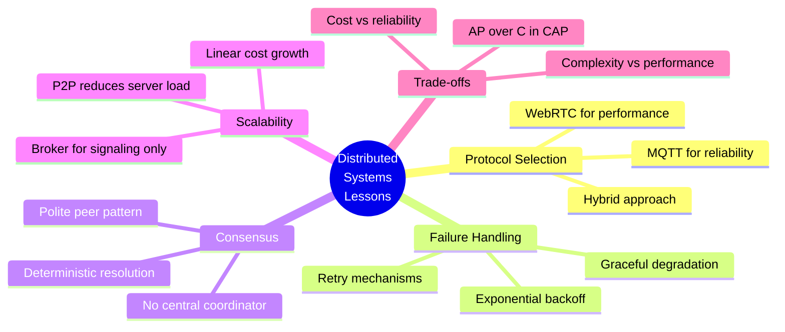

### Further Reading

- **WebRTC**: RFC 8825-8829 (WebRTC standards)
- **MQTT**: MQTT Version 5.0 Specification
- **Distributed Systems**: "Designing Data-Intensive Applications" by Martin Kleppmann
- **P2P Networks**: "Peer-to-Peer Systems and Applications" by Steinmetz & Wehrle
- **CAP Theorem**: "Brewer's Conjecture and the Feasibility of Consistent, Available, Partition-Tolerant Web Services"

---

## Conclusion

This P2P chat application demonstrates fundamental distributed systems concepts:

- **Hybrid architecture** combining centralized signaling (MQTT) with decentralized data transfer (WebRTC)
- **Fault tolerance** through retry mechanisms and offline queuing
- **Eventual consistency** accepting temporary inconsistencies for availability
- **NAT traversal** achieving network transparency
- **Scalable design** with linear cost growth

The architecture represents a practical balance between theoretical purity and real-world constraints, making it an excellent case study for distributed systems education.
